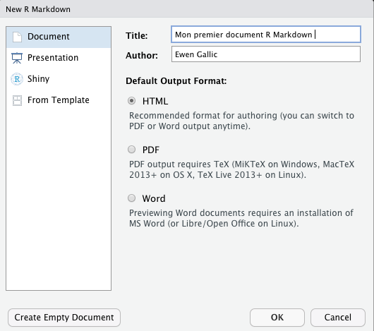
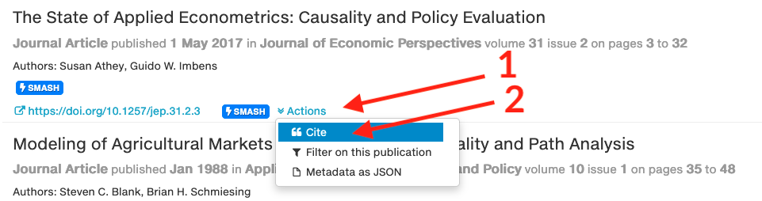
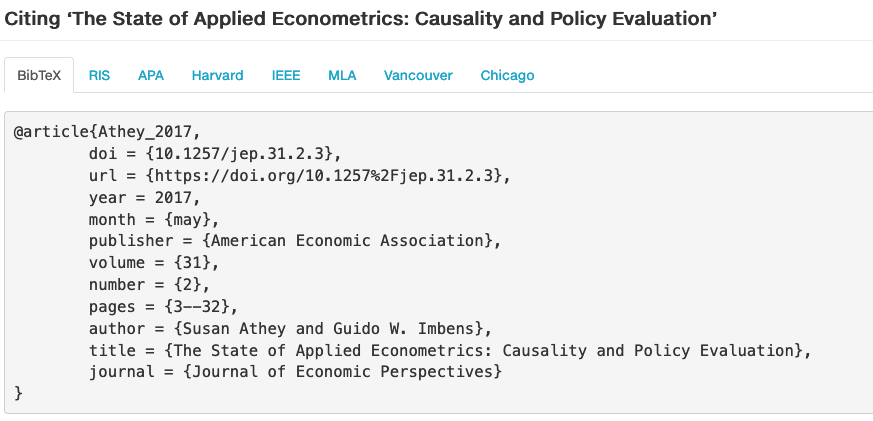
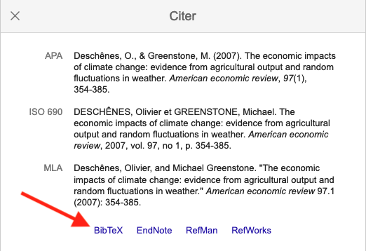

# R Markdown


Ce chapitre vise à présenter R Markdown, un environnement de travail permettant de créer des documents en *data science*.

Dans un unique fichier R Markdown, il est possible d'écrire du code et de l'exécuter, puis de produire des rapports (mêlant textes, codes, et résultats des évaluations des codes) visant à être partagés. Les codes peuvent être du R, mais pas uniquement : il est possible d'évaluer des instructions d'autres langages tels python ou SQL, entre autres. Les formats de sortie possible sont nombreux. Parmi les plus utilisés : html, pdf, Word, notebook, ioslides.

Le *package* {rmarkdown} peut être installé à l'aide de l'instruction suivante.

```{r, eval=FALSE}
install.packages("rmarkdown")
```

Le document de référence principal sur lequel s'appuie cette fiche est l'ouvrage R Markdown Cookbook, rédigé par Yihui Xie, Christophe Dervieux et Emily Riederer (Chapman & Hall/CRC, 2020). Une version électronique est disponible gratuitement à l'adresse suivante : <https://bookdown.org/yihui/rmarkdown-cookbook/>.

Une antisèche de deux pages sur le R Markdown a été réalisée par RStudio : <https://www.rstudio.com/wp-content/uploads/2015/02/rmarkdown-cheatsheet.pdf>.

## Créer un document R Markdown avec RStudio

Pour conserver la prise de bonnes habitudes initiée lors des premières séances, créez dans un premier temps un projet RStudio, en respectant l'arborescence présentée sur l'image ci-dessous.


{width="25%"}

::: {.greenbox data-latex=""}
**Création d'un projet**

Dans RStudio :

-   Cliquez sur le menu `File`, puis sur `New Project...`.
-   Cliquez sur `New Directory`, puis sur `New Project`.
-   Donnez un nom au nouveau projet, puis cliquez sur le bouton `Browse...`
-   Choisissez l'emplacement du projet, puis appuyez sur le bouton `Open`.
-   Cliquez sur le bouton `Create Project` pour créer le projet. Une nouvelle session RStudio s'ouvre alors. Le répertoire courant devient celui dans lequel vous avez créé le projet. Un fichier d'extention `.Rproj` a été créé dans ce répertoire. Il suffira d'ouvrir ce fichier à l'avenir pour ouvrir RStudio pour travailler sur ce projet.
:::

::: {.redbox data-latex=""}
Sur les ordinateurs de l'Université, vous veillerez à créer le projet dans le dossier `C:/Workout`. La compilation sur les VDI (*virtual desktop infrastructure*) semble être impossible pour le moment.

Attention : à la fin de la séance, il faudra penser à copier/coller l'ensemble du répertoire contenant votre projet dans votre dossier `Documents`. Les contenus du dossier `C:/Workout` sont effacés à la fermeture de session.
:::

À présent que le projet est créé, il est temps de créer un document R Markdown.

::: {.greenbox data-latex=""}
**Création d'un document R Markdown**

Dans RStudio :

-   Cliquez sur le menu `File`, puis sur `New File...`.

-   Cliquez sur `R Markdown...`.

-   Dans la fenêtre qui s'affiche :

    -   assurez-vous d'être dans l'onglet "Document"
    -   donnez un titre au document que vous allez créer
    -   renseignez le champ "Author" avec vos noms et prénom(s)
    -   laissez le bouton radio sur l'option `HTML` pour que le rapport qui sera créé après soit un document html (langage conçu pour présenter des pages web).
    -   créer le document en cliquant sur le bouton `OK`.

-   Sauvegardez le fichier créé en lui donnant le nom de votre choix (par exemple : `premier_rapport.Rmd`).

```{r pressure, echo=FALSE, out.width = '75%'}

```


:::

Un document R Markdown, dont l'extension est `.Rmd` est alors créé. Ce document est composé de trois parties :

-   du YAML (des méta-données) ;
-   du texte ;
-   des morceaux de code (*code chunks*).

### YAML

Dans le document que vous venez de créer, l'en-tête YAML indique :

``` {.yaml}
title: "Mon premier document R Markdown"
author: "Ewen Gallic"
date: "11/2/2022"
output: html_document
```

Le titre du document, l'auteur et la date sont précisés dans cette en-tête. Lors de la conversion du fichier Rmd en fichier html par Pandoc (un logiciel de conversion de documents), ces informations seront stockées dans des variables et apparaîtront à un ou plusieurs endroits du fichier html (selon le modèle -- *template* -- utilisé). La ligne `output: html_document`{.YAML} indique quant à elle que le document de sortie sera un document html. D'autres éléments peuvent être indiqués, notamment dans la partie `output`{.YAML} : présence d'une table des matières, numérotation des sections, ajout d'une feuille de style, etc.

En quelques mots, les étapes de conversion sont les suivantes :

-   la fonction `knit()`{.R} du *package* {`knitr`} exécute les codes contenus dans les *chunks* et prépare un fichier Markdow (`.md`)
-   le logiciel Pandoc convertit le fichier `.md` dans un format de sortie (html, pdf, etc.)

Si le format de sortie est le pdf, une étape supplémentaire est ajoutée : le fichier `.md` est converti en un fichier LaTeX (`.tex`). Une compilation du fichier `.tex` est alors effectuée par LaTeX pour obtenir le fichier pdf final. Cela nécessite de fait d'installer LaTeX ou TinyTeX sur son système.

::: {.notebox data-latex=""}
Dans le cadre de ce cours, nous ne produirons pas de documents au format html sur les ordinateurs de l'Université.
:::


#### Table des matières


Pour ajouter une table des matières dans un fichier html, on ajoute des paires de clés-valeurs :

- `toc: yes` : on désire la création d'une table des matières (_table of contents_) ;
- `toc_depth: 3` : l'entier donné en valeur définit la profondeur de la table des matières (1 : uniquement les sections, 2 : sections et sous-sections, 3 : sections, sous-sections et sous-sous sections, etc.)
- `toc_float: true` : la table des matières sera insérée comme objet flotant et visible en permanence tout le long du document.


```md
---
title: "Mon premier document R Markdown"
author: "Ewen Gallic"
date: "11/7/2022"
output: html_document:
    toc: yes
    toc_depth: 3
    toc_float: true
---
```

::: {.notebox data-latex=""}

Attention, il faut respecter les indentations, comme dans l'exemple précédent.

:::

Pour une table des matières sur un document final en pdf, le YAML doit contenir les paires `toc: yes` et `toc_depth:3`.

```md
---
title: "Mon premier document R Markdown"
author: "Ewen Gallic"
date: "11/7/2022"
output: pdf_document:
    toc: yes
    toc_depth: 3
---
```


### Textes

Le fichier `.Rmd` peut contenir du texte que l'on rédige en markdown. Davantage d'informations seront données dans la suite de cette fiche concernant la syntaxe markdown (qui est très simple).

### Morceaux de code

Les morceaux de code contiennent deux parties :

-   du code à évaluer, dans un langage donné (nous utiliserons du R) ;
-   une liste d'options pour le morceau de code.

Pour être exécuté, le code fait appel à un environnement (dans lequel des variables peuvent être créées). Cet environnement peut être modifié après l'exécution du code.

### Compilation

Pour compiler un document R Markdown, une fois le YAML bien spécifié, il suffit au choix :

-   d'appeler la fonction `render()`{.R} du *package* {`rmarkdown`} :

    -   en lui fournissant le chemin vers le fichier `Rmd` via l'argument `input`:  
    `rmarkdown::render(input = "votre_document_rmarkdown.Rmd")`{.R}
    -   il faut ensuite aller dans l'explorateur de fichier / dans Finder pour ouvrir le fichier converti

-   de cliquer sur le bouton `Knit` (on le repère facilement avec son icone d'aiguille à tricoter et sa pelote de laine) ;

-   d'appuyer simultanément sur les touches du clavier `Ctrl / Cmd + Shift + K`.

Les deux dernières solutions conduisent à un affichage du résultat dans une fenêtre qui s'ouvre à l'issue de la compilation.

::: {.greenbox data-latex=""}
Compilez votre premier fichier R Markdown avec l'une des trois manières indiquées, puis regardez le résultat.
:::

## Ecriture du texte : syntaxe en Markdown {#markdown}

Les parties textuelles qui permettent d'ajouter une narration aux rapports peuvent être rédigées en markdown. La sytaxe est très simple.


### Texte

Il suffit d'écrire comme dans un bloc note pour que le texte soit affiché dans le rapport final.  
Terminer une ligne par deux espaces permet d'aller à la ligne.

Laisser une ligne vide entre deux textes permet de créer un nouveau paragraphe.

### Styles de texte


| Style | Syntaxe  | Exemple | Rendu |
| :----- | ------: | ---------: | ---------: |
| Gras | ``** **`` ou `__ __` | `Du texte **en gras**` | Du texte **en gras** |
| Italique | `* *` ou `_ _ ` |  `Un mot en *italique*` | Un mot en *italique* |
| Barré | `~~ ~~` | `J'~~aime~~ adore R` | J'~~aime~~ adore R |
| Une partie en italique dans du gras | `**- -**` | `Un **texte _très_ important**` | Un **texte _très_ important** |
| Tout en gras et italique | `*** ***` | `***新年快樂*** (Xin nian kuai le)` | ***新年快樂*** (Xin nian kuai le) |
| Exposant | `^ ^` | `Le 1^er^ janvier` | Le 1^er^ janvier |

### Titres

Il existe six niveaux de titres dans les documents R Markdown. On fait précéder le texte du titre par autant de croisillons (`#`) que de niveau désiré.


`# Titre de niveau 1`

`## Titre de niveau 2`

`### Titre de niveau 3`

`#### Titre de niveau 4`

`##### Titre de niveau 5`

`###### Titre de niveau 6`


::: {.notebox data-latex=""}

_Notes_ : 

- il faut bien faire suivre le croisillon d'une espace ;
- il est nécessaire d'insérer une ligne vide avant et après le titre.

:::


### Citations

Pour effectuer une citation dans un bloc, il convient de faire précéder la citation du symbole >, que l'on place en début de ligne. Exemple avec`> chúc mừng năm mới` :

> chúc mừng năm mới

Pour faire en sorte qu'une citation comporte plusieurs paragraphes, un chevron (`>`) doit être ajouté au début de lignes vides.

```md
> “How can two people hate so much without knowing each other?”
>
> --- Alan Moore, _The Killing Joke_
```

> “How can two people hate so much without knowing each other?”
>
> --- Alan Moore, _The Killing Joke_


### Tirets longs, tirets moyens

Pour insérer un tiret long (cadratin), on utilise trois tirets : `--- ` ; pour un tiret court (ou demi-cadratin), on utilise deux tirets : `--`.


| Symbole voulu | Syntaxe  | Exemple | Rendu |
| :---------- | ------: | ------: | ------: | ------: |
| Tiret long (cadratin) | `---` | `--- une réplique` | --- une réplique |
| Tiret moyen (demi-cadratin) | `--` | `La frontière France--Italie` | La frontière France--Italie |

### Lignes horizontale


En inscrivant trois tirets `---` et en passant immédiatement à la ligne, une ligne horizontale est insérée.

---


### Points de suspension

Pour écrire des points de suspension, il suffit d'écrire trois points (`...`) à la suite...


### Liens hypertextes {#liens-hypertextes}

La création d'un lien hypertexte se fait en utilisant deux éléments : un texte sur lequel on clique, qui doit être entouré par des crochets `[]` et une adresse vers laquelle le lien point, qui doit être entourée par des parenthèses (`()`).

```md
Regardez cette [vidéo épatante](https://www.youtube.com/watch?v=dQw4w9WgXcQ).
```

Regardez cette [vidéo épatante](https://www.youtube.com/watch?v=dQw4w9WgXcQ).

Pour créer un lien sans définir de texte spécifique en remplacement de l'URL, il est possible de simplement écrire l'URL. Il est toutefois préférable d'encadrer l'URL par des chevrons. Il en va de même pour une adresse email.

```md
<https://www.youtube.com/watch?v=oavMtUWDBTM>  
<ewen.gallic@univ-amu.fr>
```

<https://www.youtube.com/watch?v=oavMtUWDBTM>  
<ewen.gallic@univ-amu.fr>


Pour créer une ancre (un lien vers un endroit précis de la page déjà affichée) **vers un titre** du document, il faut connaître la référence vers le [point d'ancrage](#lien-ancre). Un moyen simple consiste à la définir soi-même, en utilisant la syntaxe suivante :

```md
# Le titre {#nom-de-la-reference}
```

Le nom de la reference ne doit pas contenir d'espaces ni de traits de soulignement (`_`). Il peut en revanche, comme dans l'exemple, contenir des tirets (`-`).


Dans ce document, la sous section dans laquelle ce texte est inscrit, est définie comme suit :

```md
## Liens hypertextes {#liens-hypertextes}
```


```md
On peut ainsi faire un lien vers cette [section](#liens-hypertextes).
```

On peut ainsi faire un lien vers cette [section](#liens-hypertextes).


### Notes de bas de page


L'insertion de notes de bas de page numérotées s'effectue à l'aide de crochets (`[]`) contenant un accent circonflèxe et une référence qui peut être soit un nombre, soit un texte (mais sans espace ou autre caractère blanc).

Le numéro de la note de bas de page est un lien qui renvoie vers la note. Une flèche de retour est proposée pour ramener au texte lorsque le document créé est un document html.

```md
Une note de bas de page simple[^1] suivie d'une plus longue[^longue-note].

[^1]: la note de bas de page.

[^longue-note]: une note de bas de page plus longue.

    Dans laquelle on peut écrire un paragraphe.

    `{ du code }`

    Plusieurs paragraphes, même.
````


Une note de bas de page simple[^1] suivie d'une plus longue[^longue-note].


[^1]: la note de bas de page.

[^longue-note]: une note de bas de page plus longue.

    Dans laquelle on peut écrire un paragraphe.

    `{ du code }`

    Plusieurs paragraphes, même.


### Listes

On distingue deux types de listes : les listes ordonnées et les listes non ordonnées.

#### Listes ordonnées

Pour créer une liste ordonnée, on place en début de ligne, devant chaque élément de la lique, un nombre immédiatement suivi d'un point et d'une espace.

```md
1. Un premier élément ;
2. Un deuxième élément ;
3. Un troisième élément.
```

1. Un premier élément ;
2. Un deuxième élément ;
3. Un troisième élément.

Il n'est pas nécessaire de respecter la numérotation :

```md
1. Un premier élément ;
10. Un deuxième élément ;
5. Un troisième élément.
```

1. Un premier élément ;
10. Un deuxième élément ;
5. Un troisième élément.

Le numéro du premier élément de la liste ordonnée définit la valeur du compteur :


```md
4. Un premier élément ;
10. Un deuxième élément ;
5. Un troisième élément.
```

4. Un premier élément ;
10. Un deuxième élément ;
5. Un troisième élément.


#### Listes non ordonnées

Pour insérer une liste non ordonnée, on fait précéder chaque élément du symbole `-` ou du symbole `*`.

```md
Une liste comprenant :

* un premier élément ;
* un deuxième élément ;
* un troisième élément.
```

Une liste comprenant :

* un premier élément ;
* un deuxième élément ;
* un troisième élément.


### Listes imbriquées

Pour ajouter une liste à l'intérieur d'une liste, il faut ajouter avant le tiret ou l'étoile soit un taquet de tabulation, soit 4 espaces.

```md
- un premier élément ;
- un deuxième élément :
    - qui contient un sous-élement,
    - ainsi qu'un deuxième sous-élément,
    - et un troisième ;
- puis un troisième élément.
```

- un premier élément ;
- un deuxième élément :
    - qui contient un sous-élement,
    - ainsi qu'un deuxième sous-élément,
    - et un troisième ;
- puis un troisième élément.


Pour écrire un paragraphe à l'intérieur d'une liste, une identation (taquet de tabulation ou 4 espaces) doit être ajoutéé, pour préserver la continuité de la liste. Il faut également faire précéder le paragraphe d'une liste vide (on peut aussi ajouter une ligne vide après le paragraphe, mais celle-ci est optionnelle).


```md
- un premier élément ;
- un deuxième élément :

    qui contient un paragraphe.
    
- puis un troisième élément.
```

- un premier élément ;
- un deuxième élément :

    qui contient un paragraphe.
    
- puis un troisième élément.


Il est tout à fait possible d'imbriquer une liste ordonnée dans une liste non ordonnée et vice-versa.

```md
1. Un premier élément :
    - avec un sous-élément ;
2. Un deuxième élément.
```

1. Un premier élément :
    - avec un sous-élément ;
2. Un deuxième élément.


::::{.notebox data-latex=""}

Règles de typographie : 

En français, les listes sont généralement introduites par une phrase se terminant par deux tirets (`:`). Les éléments de la liste ne commencent alors pas par une majuscule. Les éléments sont séparés par un point virgule (`;`), et le dernier élément se termine par un point.

Une liste comprenant :

* un premier élément ;
* un deuxième élément ;
* un troisième élément.

Lorsque la liste est numérotée, il faut en revanche mettre une majuscule à chaque élément de la liste

Une liste comprenant :

1. Un premier élément ;
2. Un deuxième élément ;
3. Un troisième élément.


Lorsqu'une liste se compose de plusieurs phrases, chaque élément commence par une majuscule et se termine par un point.

Les personnes pouvant postuler :

- Pour les personnes ayant validé une Licence 2 mention "Économie-Gestion" à Aix-Marseille Université ou dans une autre Université française : entrée de droit dans le parcours.
- Pour les personnes ayant validé un niveau équivalent à la Licence 2 en Économie ou en Économie-Gestion (Licence 2 mention Économie, DUT, CPGE, etc.) : une commission pédagogique évalue les dossiers notamment sur la base des pré-requis mentionnés plus haut ainsi que sur la base des projets de Master des étudiantes et étudiants.

- les règles de typographie françaises indiquent qu'il est d'usage de placer un point virgule à la fin des éléments de niveau 1 ou au dernier élément de niveau supérieur à 1 si celui-ci est immédiatement suivi par un élément de niveau 1 ;
- pour les éléments de niveau 2, une 

En cas de listes imbriquées, la virgule est utilisée en fin de ligne, sauf pour le dernier élément de la liste imbriquée qui lui, s'achève par un point virgule ou un point s'il s'agit du dernier élément de la liste.

Une liste qui comprend :

- un élément de niveau 1
- un autre élément de niveau 1 :

    - avec un sous-élément de niveau 2,
    - ainsi qu'un autre ;
- un troisième élément de niveau 1.

:::


### Images


L'ajout d'une image se fait en insérant un point d'exclamation (`!`), suivi d'une d'un titre entre crochets, puis du chemin vers l'image, entre parenthèses (`()`). Une description de l'image peut être ajoutée entre guillemets (`""`) après le chemin, toujours dans les parenthèses (cette description est visible au survol de l'image, lorsque le pointeur de la souris reste quelques secondes au-dessus de l'image, et peut être lue à voix haute par les systèmes destinés aux personnes en situation de handicap). Enfin, pour spécifier des paramètres de taille de l'image, il est possible d'ajouter des informations entre crochets (`{}`).

```md
{width="200px"}
```

{width="200px"}


### Tableaux

La création d'un tableau se fait en distinguant l'en-tête du corps du tableau. Chaque cellule est séparée à l'aide d'une barre verticale (`|`, `Alt gr + 6` sur un clavier azerty sous Windows, et Alt + Shift + L` sur Mac Os). On ajoute des barres verticales au début et à la fin de chaque ligne du tableau. Pour délimiter l'en-tête du corps du tableau, trois tirets ou plus doivent être placés entre les barres verticales.

```md
| Première colonne | Deuxième colonne | Troisième colonne |
| ---------------- | ---------------- | ----------------- |
| cellule 1, ligne 1 | cellule 2, ligne 1 | cellule 3, ligne 1 |
| cellule 1, ligne 2 | cellule 2, ligne 2 | cellule 3, ligne 2 |
| cellule 1, ligne 3 | cellule 2, ligne 3 | cellule 3, ligne 3 |
```


| Première colonne | Deuxième colonne | Troisième colonne |
| ---------------- | ---------------- | ----------------- |
| cellule 1, ligne 1 | cellule 2, ligne 1 | cellule 3, ligne 1 |
| cellule 1, ligne 2 | cellule 2, ligne 2 | cellule 3, ligne 2 |
| cellule 1, ligne 3 | cellule 2, ligne 3 | cellule 3, ligne 3 |

#### Alignement


La gestion de l'alignement des colonnes se fait à l'aide de la deuxième ligne, celle composée des tirets. Pour un alignement à gauche, on ajoute deux points (`:`) à gauche des tirets, pour un alignement à droite, on ajoute ces deux points à droite des tirets, et pour une colonne centrée, on ajoute les deux points à la fois à gauche et à droite.

```md
| Colonne alignée à gauche | Colonne centrée | Colonne alignée à droite |
| :---------------- | :----------------: | -----------------: |
| cellule 1, ligne 1 | cellule 2, ligne 1 | cellule 3, ligne 1 |
| cellule 1, ligne 2 | cellule 2, ligne 2 | cellule 3, ligne 2 |
| cellule 1, ligne 3 | cellule 2, ligne 3 | cellule 3, ligne 3 |  
```

| Colonne alignée à gauche | Colonne centrée | Colonne alignée à droite |
| :---------------- | :----------------: | -----------------: |
| cellule 1, ligne 1 | cellule 2, ligne 1 | cellule 3, ligne 1 |
| cellule 1, ligne 2 | cellule 2, ligne 2 | cellule 3, ligne 2 |
| cellule 1, ligne 3 | cellule 2, ligne 3 | cellule 3, ligne 3 |


### Formules mathématiques en LaTeX

Il est possible d'utiliser du LaTeX pour écrure des équations mathématiques en Markdown. On distingue deux types de formules :

1. les formules en ligne : en entourant l'expression des symboles dollar (`$equation$`)
2. les formules en mode _display_ : en entourant l'expression de deux symboles dollar de chaque côté (`$$equation$$`).

```md
Les formules en ligne, $f(x)=x^2+3x+4, x\in\mathbb{R}$, permettent
d'insérer des formules dans un paragraphe, tandis que les formules en mode
_display_ permettent d'insérer des formules dans un bloc à part $$X\sim\mathcal{N}(0,1).$$
```


Les formules en ligne, $f(x)=x^2+3x+4, x\in\mathbb{R}$, permettent d'insérer des formules dans un paragraphe, tandis que les formules en mode _display_ permettent d'insérer des formules dans un bloc à part $$X\sim\mathcal{N}(0,1).$$


Une antisèche réalisée par Jim Hefferon, permettant de rédiger des formules en LaTeX est disponible sur le réseau complet d'archives TeX (CTAN) : <http://tug.ctan.org/info/undergradmath/undergradmath.pdf>.


### Codes et blocs de code {#md-codes-blocs-codes}

Pour présenter du code, il existe deux manières en RMarkdown : soit des codes en ligne, directement insérés dans le texte, soit des blocs de code. Pour écrire des codes en ligne, on écrit le code entre deux accents graves (`` ` ` ``, `Alt gr + 7` sur un clavier azerty sous Windows, touche `` ` `` sous Mac Os). Si on désire avoir une coloration syntaxique, il faut de surcroît indiquer le langage entre crochets (`{}`), après un point (`{.nom-du-langage}`) :

```md
La fonction `mean(x)`{.R} permet de calculer la moyenen de `x`.  
L'instruction `SELECT * FROM base`{.SQL} permet de récupérer
l'ensemble des colonnes de la base `base` en SQL.
```

La fonction `mean(x)`{.R} permet de calculer la moyenen de `x`.  
L'instruction `SELECT * FROM base`{.SQL} permet de récupérer l'ensemble des colonnes de la base `base` en SQL.


Pour insérer des blocs de code, on utilise trois accents grave (`` ``` ``) avant et après le code :


````md
```
x <- mean(ventes$Sales, na.rm=TRUE)
```
````

Ce qui produira :

```
x <- mean(ventes$Sales, na.rm=TRUE)
```

À nouveau, si le langage du code contenu dans le bloc est spécifié, on obtient une coloration syntaxique. Le nom du langage est donné immédiatement après les trois accents graves.

````md
```r
x <- mean(ventes$Sales, na.rm=TRUE)
```
````

Donnera :

```r
x <- mean(ventes$Sales, na.rm=TRUE)
```


## Morceaux de code

Les codes et blocs de codes rédigés dans la [section "Codes et blocs de code"](#md-codes-blocs-codes) ne sont jamais exécutés. Un des intérêts du RMarkdown réside dans la possibilité d'évaluer des codes (nous n'exécuterons ici que du R, mais il est possible d'exécuter d'autres langages dans un ficher RMarkdown), de les afficher, et d'afficher les résultats et sorties résultants de l'évaluation.

À nouveau, on peut distinguer deux types de codes : ceux en ligne et les blocs ou _chunks_ de code.

### Codes en ligne

Les codes en ligne sont délimités avec un accent grave au début et un à la fin, comme en markdown. La seule différence est que le nom du langage figure immédiatement après le premier accent grave. Le code ne sera pas retourné, seul son résultat apparaîtra dans le document final. Prenons un exemple simple.


````md
La moyenne des notes est de `r '\x60r mean(c(20, 18, 15, 16))\x60'`.
````

La moyenne des notes est de `r mean(c(20, 18, 15, 16))`.


### Blocs de code

Pour insérer des blocs de code, on utilise comme en markdown les trois accents graves avant et après le code. On fait suivre le troisième accent grave du début par le nom du langage, entre crochets ({r}) :


````md
`r ''````{r}
x <- c(20, 18, 15, 16)
x
```
````

Le résultat est le suivant :

```{r}
x <- c(20, 18, 15, 16)
x
```


On note que par défaut, le code est présent dans le document final ainsi que le résultat de son évaluation (tel qu'affiché dans la console).

_Note_ : nous venons de créer l'objet `x` dans l'environnement. Nous pouvons le réutiliser dans un nouveau code, qu'il soit en ligne (`` `r ` ``) : `r x` ou dans un _chunk_ (```` ```{r} ``` ````):

````md
`r ''````{r}
x
```
````

qui donne ensuite :

```{r}
x
```


::: {.notebox data-latex=""}
**Note** : pour insérer un _chunk_, on peut utiliser le raccourci `Ctrl + Alt + I` sous Windows ou bien `cmd + alt/option + I` sous Mac Os.
:::


#### Paramètres des chunks


Lorsqu'on définit un _chunk_, il est possible d'ajouter de nombreuses options qui auront un impact sur le fonctionnement du _chunk_. Par exemple, on peut demander d'afficher le code sans l'exécuter, d'afficher le résultat en masquant le code, ou bien de contrôler les paramètres d'affichage des figures si le code en produit. Il existe plus de 50 paramétrages. La liste est disponible sur le site du créateur du _package_ {`knitr`} : <https://yihui.org/knitr/options/>.


La syntaxe est la suivante :

````md
`r ''````{r, options}
code
```
````

Une bonne pratique consiste à attribuer un identifiant unique à chaque _chunk_.

````md
`r ''````{r identifiant-du-chunk, options}
x
```
````


Voici quelques options pratiques.

| Syntaxe | Effet |
| :------ | ----: |
| `include = FALSE` | Ni le code ni les éventuels résultats affichés dans la console n'apparaitront dans le document final. |
| `echo = FALSE` | Le code n'apparaîtra pas dans le résultat final, tandis que les résultats seront visibles. |
| `eval = FALSE` | Le code apparaîtra dans le document final mais ne sera pas exécuté. |
| `message = FALSE` | Les messages générés par l'excution du code n'apparaîtront pas dans le document final. |
| `warning = FALSE` | Les messages d'avertissement générés par l'excution du code n'apparaîtront pas dans le document final. |
| `fig.cap = "titre"` | Si le code produit une image, le titre indiqué entre les guillemets sera utilisé comme titre de la figure |
| `fig.width = "2"`, `figh.height="4` | Si le code produit une image, permet de définir sa largeur et sa hauteur, respectivement. Les valeurs sont données en pouces (_inches_). |
| `out.width='50%'`, `out.height='75%'` | Si le code produit ou affiche une image, permet de définir, en pourcentages, la taille de l'image. |

Voici un exemple avec une image :

````md
`r ''````{r plot-iris, out.width='75%',
fig.cap = "Largeur des sépals en fonction de leur longueur."}
plot(iris$Sepal.Length, iris$Sepal.Width)
```
````

Ce qui donne :

```{r plot-iris, out.width='75%', fig.cap = "Largeur des sépals en fonction de leur longueur."}
plot(iris$Sepal.Length, iris$Sepal.Width)
```


Le paramétrage de l'**ensemble** des _chunks_ est réglé par une liste (`knitr::opts_chunk`{.R}). En modifiant les valeurs de cette liste comme dans l'exemple ci-dessous, et en plaçant cette instruction dans un _chunk_ positionné juste après l'en-tête en YAML, tous les _chunks_ adopteront le comportement spécifié.

Dans l'exemple ci-dessous, tous les codes des _chunks_ seront visibles (`echo = TRUE`{.R}), les messages et les avertissements retournés lors de l'exécution des codes seront masqués (`message = FALSE`{.R} et `warning = FALSE`{.R}), les figures produites en R seront centrées (`fig.align = "center"`{.R})

````md
`r ''````{r chunks-settings, echo=FALSE, include=TRUE, message=FALSE, warning=FALSE}
knitr::opts_chunk$set(echo = TRUE,
                      message = FALSE,
                      warning = FALSE,
                      fig.align = "center")
```
````


::: {.notebox data-latex=""}
**Note** : le paramétrage du comportement général des _chunks_ peut ensuite être modifié pour certains _chunks_ spécifiques. Pour ce faire, il suffit d'ajouter dans les paramètres des _chunks_ à modifier le comportement désiré. Par exemple, si `echo = TRUE`{.R} est défini dans la liste des paramètres de la liste `knitr::opts_chunk`{.R}, si on souhaite masquer le code d'un _chunk_ spécifique, il suffit de lui ajouter l'option `echo = FALSE`{.R} :

````md
`r ''````{r, echo=FALSE}
# code du chunk
```
````

:::


### Mise en cache

Lorsqu'un document RMarkdown comprend des calculs qui prennent beaucoup de temps à s'effectuer lors de la compilation, il est possible de mettre en cache les résultats de tout ou partie des _chunks_. Pour ce faire, il suffit d'indiquer le paramètre `cache = TRUE` dans le ou les _chunks_ que l(on souhaite mettre en cache. 

Lors de la compilation du document, les _chunks_ ayant été mis en cache ne seront pas exécutés par {`knitr`} s'ils ont été exécutés lors de la précédente compilation et qu'aucune modification ne leur a été apportée. Si le code à l'intérieur d'un _chunk_ a été modifié entre le moment où il a été exécuté par {`knitr`} lors d'une compilation et une nouvelle compilation (ou si un paramètre du _chunk_ autre que `include`{.R} a été modifié), alors il sera de nouveau réévalué et remis en cache.


Il est risqué de paramétrer l'ensemble des _chunks_ de sorte qu'ils soient tous mis en cache. Si le j^e^ _chunks_ est modifié, il sera réévalué par {`knitr`} lors de la compilation. Or, si l'évaluation dépend de variables définies avant le j^e^ _chunk_ mais ayant été modifiées _après_, les résultats retournés par la nouvelle évaluation du j^e^ _chunk_ risquent de ne pas être reproductibles...

Il est parfois utile de vider le cache pour éviter les erreurs mentionnées précédemment. Pour ce faire, on peut cliquer sur la flèche pointant vers le bas située à droite du bouton `Knit`, puis cliquer sur la ligne commençant par l'emoji ballet `Clear Knitr Cache...`.

::: {.notebox data-latex=""}

**Note** : la mise en cache est surtout utile lordque l'on charge des résultats d'estimation de modèles longs à calculer (des modèles de machine-learning par exemple).

:::


## Insertion d'une bibliographie


Citer une source répond à des normes. Une des normes fréquemment rencontrées en économie est celle de l'association américaine de psychologie (American Psychological Association). Elle reprend l'acronyme de l'association : APA.

Des explications en français sur ces normes sont proposées sur le site des bibliothèques de l'Université de Montréal à l'adresse suivante <https://bib.umontreal.ca/citer/styles-bibliographiques/apa>.

On distingue deux manières de citer des références : dans le texte et en bibliographie.


Avec RMarkdown, nous n'avons qu'à nous soucier de la citation dans le texte. L'ajout des références citées en bibliographie se fait ensuite automatiquement, en respectant la norme utilisée. Pour cela, il faut :

1. créer un fichier contenant les références, en les distinguant à l'aide d'un identifiant unique ;
2. créer le lien entre ce fichier et le document RMarkdown, en le renseignant dans l'en-tête YAML ;
3. insérer les références aux documents, dans la partie narrative (texte) du document RMarkdown.

### Création du fichier de bibliographie

Un fichier de bibliographie au format `.bib` (BibTeX) doit dans un premier temps être créé. Ce fichier contient les références, formatées selon le standard attendu des fichiers bib. Sur le site bibtex.com, la page suivante propose un guide sur les formats BibTeX. <https://www.bibtex.com/g/bibtex-format/>.


Chaque entrée dans le fichier BibTeX correspons à une référence bibliographique. Elle est composée de trois parties :

1. le type de document : book (livre), article, inbook (un chapitre de livre), inproceedings (un article de colloque), techreport (un rapport technique), etc ;
2. un identifiant unique (que l'on utilise ensuite dans le fichier RMarkdown pour faire référence à cette entrée) ;
3. une liste de paires de clés-valeurs, où les éléments de la référence sont stockés (titre, auteurs, année de publication, nom de la revue, nom de l'éditeur, etc.).

Prenons un exemple :

```bib
@book{xie_2018_rmarkdown,
  title={R markdown: The definitive guide},
  author={Xie, Yihui and Allaire, Joseph J and Grolemund, Garrett},
  year={2018},
  publisher={Chapman and Hall/CRC}
}
```

Il s'agit d'un livre, donc le type de document est indiqué à l'aide de `@book`{.bib}. La référence unique est `xie_2018_rmarkdown`, et les paires de clés-valeurs sont renseignées dans une liste où chaque clé est donnée avant le symbole égal et chaque valeur est donnée après le symbole égal. Les paires sont séparées par une virgule.

:::{.greenbox data-latex=""}

À votre tour : créez un nouveau fichier de script R dans RStudio. Dans ce fichier, collez l'entrée bibliographique du livre de Yihui Xie et al. Enregistrez le document en le nommant `biblio.bib`.

Il vous sera demandé si vous souhaitez changer l'extension du fichier pour effectivement utiliser `.bib` plutôt que `.R` : dites oui.

:::

Afin d'éviter de devoir rédiger à la main l'ensemble des entrées du fichier BibTeX, il existe de nombreux outils pour nous faciliter le travail. Nous allons en voir quelques-uns.

#### Crossref

Dans un premier temps, on peut vérifier si la référence existe sur [Crossref](https://www.crossref.org/). Ce site est très pratique pour obtenir des citations généralement propres, mais il a un inconvénient : il faut parfois être patient, le site rencontre fréquemment des erreurs 500 (_Internal Server Error_).

Essayons de chercher la référence pour l'article de Susan Athey intitulé "The State of Applied Econometrics: Causality and Policy Evaluation", publié dans "The Journal of economic perspectives" (JEP) en 2017.

Après avoir cliqué sur le bouton "Search metadata", on peut coller le titre de l'article : `The State of Applied Econometrics: Causality and Policy Evaluation`, puis lancer la recherche en appuyant sur la touche `Enter` du clavier.

{width="30%"}

Parmi les références proposées, lorsqu'on a identifié celle qui correspond effectivement à celle que l'on recherche, on récupère les métadonnées en cliquant sur le lien `Actions` puis sur `Cite`.

{width="75%"}

L'entrée bibliographique au format BibTeX est alors affichée, il ne reste plus qu'à la copier et à la coller dans notre fichier bib.

{width="75%"}


:::{.greenbox data-latex=""}

À votre tour : recherchez la référence de l'article de Susan Athey publié dans le JEP en 2017 et collez l'entrée dans votre fichier BibTeX.

:::

Votre fichier BibTeX doit à présent contenir deux entrées (n'oubliez pas de le sauvegarder) :

```bib
@book{xie_2018_rmarkdown,
  title={R markdown: The definitive guide},
  author={Xie, Yihui and Allaire, Joseph J and Grolemund, Garrett},
  year={2018},
  publisher={Chapman and Hall/CRC}
}
@article{Athey_2017,
	doi = {10.1257/jep.31.2.3},
	url = {https://doi.org/10.1257%2Fjep.31.2.3},
	year = 2017,
	month = {may},
	publisher = {American Economic Association},
	volume = {31},
	number = {2},
	pages = {3--32},
	author = {Susan Athey and Guido W. Imbens},
	title = {The State of Applied Econometrics:
	Causality and Policy Evaluation},
	journal = {Journal of Economic Perspectives}
}
```

#### Google Scholar

Parfois, on ne trouve pas l'information désirée sur Crossref. Il peut alors être une bonne idée d'aller chercher sur [Google Scholar](https://scholar.google.fr/schhp?hl=fr) si la référence existe. Pour l'heure, les références sur Google Scholar ont l'air d'être moins bien renseignées que sur Crossref.

Essayons de retrouver la référence du papier d'Olivier Deschênes et de Michael Greenstone publié dans l'American Economic Review (AER) en 2007. Cherchons le papier par son titre :

> The economic impacts of climate change: evidence from agricultural output and random fluctuations in weather


Une fois l'article identifié dans les résultats, il suffit de cliquer sur le lien `Citer`.

{width="75%"}

Une fenêtre surgit. Les citations pré-formatées selon différents styles sont données. Pour récupérer les métadonnées au format BibTeX, il faut cliquer sur le lien `BibTeX`.

{width="75%"}

Les métadonnées s'affichent dans une page web. Il ne reste plus qu'à effectuer un copier/coller dans le fichier BibTeX.

:::{.greenbox data-latex=""}

À votre tour : recherchez la référence de l'article d'Olivier Deschênes et de Michael Greenstone publié dans l'AER en 2007 et collez l'entrée dans votre fichier BibTeX.

:::


Votre fichier BibTeX doit à présent contenir trois entrées (n'oubliez pas de le sauvegarder) :

```bib
@book{xie_2018_rmarkdown,
  title={R markdown: The definitive guide},
  author={Xie, Yihui and Allaire, Joseph J and Grolemund, Garrett},
  year={2018},
  publisher={Chapman and Hall/CRC}
}
@article{Athey_2017,
	doi = {10.1257/jep.31.2.3},
	url = {https://doi.org/10.1257%2Fjep.31.2.3},
	year = 2017,
	month = {may},
	publisher = {American Economic Association},
	volume = {31},
	number = {2},
	pages = {3--32},
	author = {Susan Athey and Guido W. Imbens},
	title = {The State of Applied Econometrics:
	Causality and Policy Evaluation},
	journal = {Journal of Economic Perspectives}
}
@article{deschenes2007economic,
  title={The economic impacts of climate change:
  evidence from agricultural output and random fluctuations in weather},
  author={Desch{\^e}nes, Olivier and Greenstone, Michael},
  journal={American economic review},
  volume={97},
  number={1},
  pages={354--385},
  year={2007}
}
```


#### Un générateur de citations

Si jamais la référence que l'on cherche n'est disponible ni sur le site du journal ou de l'éditeur, ni sur crossref, ni sur Google Scholar, il reste la possibilité d'utiliser un générateur de citations comme celui proposé sur ce site : <https://www.bibme.org/bibtex>. Il est également évidemment possible de rentrer l'ensemble des informations à la main (mais gare aux erreurs !).


### Lier le fichier d'entrées bibliographiques avec le document RMarkdown

Une fois le fichier BibTeX créé, il faut renseigner dans l'en-tête YAML (en-tête de métadonnées) :

1. un chemin vers le fichier de bibliographie (dans l'exemple ci-dessous, on suppose que le fichier `biblio.bib` se trouve dans le même répertoire que le fichier RMarkdown) ;
2. éventuellement, on peut préciser le style voulu (ici, nous utilisons la norme APA) ;
3. éventuellement, on peut indiquer que nous souhaitons que les citations soient cliquables et renvoient vers la bibliographie


````md
---
output: html_document
bibliography: biblio.bib
biblio-style: apalike
link-citations: yes
---
````


### Citer les documents dans le corps de texte

Nous disposons à présent d'un fichier BibTeX contenant 3 entrées, l'en-tête du document RMarkdown précise où se situe ce fichier d'entrées bibliographiques. Reste à présent à citer les entrées dans le texte.

Pour citer un document, on doit utilise son identifiant unique que l'on place entre crochets, après un symbole arobase : `[@identifiant]`.


| Description | Syntaxe | Affichage dans le texte |
| :------ | ------: | -----: |
| Citation entre parenthèses | `[@xie_2018_rmarkdown]` | [@xie_2018_rmarkdown] |
| Supprimer la mention de l'auteur | `[-@xie_2018_rmarkdown]` | [-@xie_2018_rmarkdown] |
| Ajout d'informations supplémentaires | `[voir @xie_2018_rmarkdown, pp. 10--12]` | [voir @xie_2018_rmarkdown, pp. 10--12] |
| Citation multiple | `[@xie_2018_rmarkdown;Athey_2017]` | [@xie_2018_rmarkdown; @Athey_2017] |
| Citation sans les parenthèses pour les auteurs | `@xie_2018_rmarkdown` | @xie_2018_rmarkdown |


La bibliographie à la fin du document sera automatiquement ajoutée. On peut placer une section `# Références` à la fin du document pour faire une rupture avec la section précédente. Cette section ne sera pas numérotée.


<!-- # Seance 6 -->
<!-- # Faire des tableaux de résumés statistiques + exports -->
<!-- # Markdown -->

<!-- # Seance 7 -->
<!-- # regressions -->

<!-- # Seance 8 -->
<!-- # Fonctions -->
<!-- # Boucles -->


<!-- # Seance 10 -->
<!-- # Graphiques -->

<!-- # Seance 11 -->
<!-- # Graphiques -->