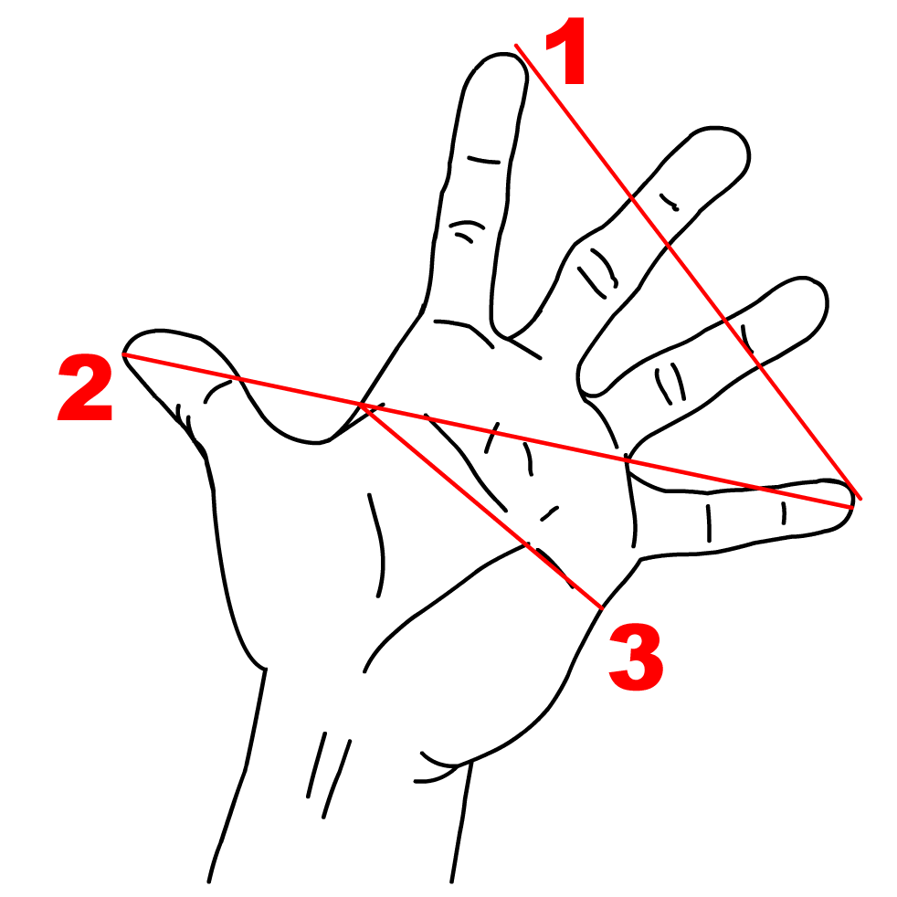

# Régressions linéaires

::::{.orangebox data-latex=""}

Pour aborder sereinement ce chapitre, il est utile de savoir [manipuler des vecteurs](http://egallic.fr/Enseignement/R/Book/donn%C3%A9es.html#structures-de-base), [des matrices](http://egallic.fr/Enseignement/R/Book/donn%C3%A9es.html#calculs-matriciels) et des [tableaux de données](http://egallic.fr/Enseignement/R/Book/donn%C3%A9es.html#tableaux_de_donnees).

Des compléments de lecture sont disponibles dans le chapitre des notes de cours concernant la [régression linéaire avec R](http://egallic.fr/Enseignement/R/Book/r%C3%A9gressions-lin%C3%A9aires.html).

:::


## Contexte et rappels

Dans ce chapitre, nous allons utiliser R pour estimer la relation entre une variable à expliquer et une ou plusieurs autres variables. Nous effectuerons quelques rappels d'économétrie, puis effectuerons les calculs à la main dans un premier temps. Ensuite, nous utiliserons des routines permettant d'estimer des modèles de régression linéaire et nous attacherons à expliquer comment lire et extraire les résultats obtenus.

Pour illustrer notre propos, nous tâcherons de relier la mesure de la taille de l'empan à la taille d'un humain. L'empan correspond à la distance entre l'extrêmité du pouce et celle de l'auriculaire, comme illustré sur la Figure \@ref(fig:illustration-empan).

{width="500px"}


En notant $y_i$ la taille de l'individu $i$, et $x$ son empan, il s'agit de regarder si la taille dépend linéairement de l'empan. On pose alors, pour tous les individus $i = 1, \\ldots, n$:

$$y_i = \beta_0 x_i + \beta_1 + \varepsilon_i,$$
avec $\mathbb{E}(\varepsilon_i) = 0, \quad \forall i \in 1,\ldots, n$, $\mathbb{E}(\varepsilon_i \varepsilon_j) = 0, \forall i \ne j$, et $\mathbb{V}(\varepsilon_i) = \sigma^2_{\varepsilon}, \quad \forall i = 1, \ldots, n.$

En termes matriciels, on peut noter :
$$\boldsymbol y = \boldsymbol X \boldsymbol \beta + \boldsymbol \varepsilon,$$
avec $\boldsymbol \varepsilon \sim \mathcal{N}(0, \Sigma^2)$, et 
\begin{align*}
\textrm{où } \boldsymbol y = \begin{bmatrix}
y_1 \\ y_2 \\ \vdots \\ y_n
\end{bmatrix}, \, \boldsymbol X = \begin{bmatrix}
1 & x_{1,1}  \\
1 & x_{1,2}  \\
1 & \vdots  \\
1 & x_{1,n} 
\end{bmatrix}, \, \boldsymbol \beta =  \begin{bmatrix}
\beta_0\\
\beta_1\\
\end{bmatrix} \textrm{ et } \boldsymbol \varepsilon = \begin{bmatrix}
\varepsilon_1\\
\varepsilon_2\\
\vdots\\
\varepsilon_n
\end{bmatrix}.
\end{align*}

La méthode des moindres carrés ordinaires (MCO) propose une estimation $(\hat\alpha, \hat\beta)$ telle que la somme des carrés des résidus soit minimisée:
$$\arg \min_{\boldsymbol \beta}\mid \mid \boldsymbol y - \boldsymbol X \boldsymbol \beta \mid \mid^2 = \arg \min_{\boldsymbol \beta} \sum_{i=1}^{n} (y_i - x_i \beta)^2.$$

Les résidus correspondent à l'écart entre la valeur observée de la taille $y_i$ et celle prédite par le modèle $\hat y_i$ : $e_i = y_i - \hat y_i$.

Le modèle estimé s'écrit :

$$\hat{y_i} = \hat{\beta_0} + \hat{\beta_1} x_i,$$
soit, en termes matriciels:
$$\hat{\boldsymbol y} = \boldsymbol X \hat{\boldsymbol \beta},$$
\begin{align*}
\textrm{où } \hat{\boldsymbol y} = \begin{bmatrix}
\hat{y}_1 \\ \hat{y}_2 \\ \vdots \\ \hat{y}_n
\end{bmatrix}, \, \boldsymbol X = \begin{bmatrix}
1 & x_{1,1} \\
1 & x_{1,2} \\
1 & \vdots \\
1 & x_{1,n}
\end{bmatrix}, \textrm{ et } \hat{\boldsymbol \beta} =  \begin{bmatrix}
\hat{\beta}_0\\
\hat{\beta}_1\\
\end{bmatrix}.
\end{align*}

La condition du premier ordre donne^[On utilise les propriétés suivantes : $\frac{\partial \boldsymbol x^t \boldsymbol A}{\partial \boldsymbol x} = \boldsymbol A^t$, $\frac{\partial \boldsymbol A \boldsymbol x}{\partial \boldsymbol x} = \boldsymbol A$ et $\frac{\partial a \boldsymbol \varepsilon}{\partial \boldsymbol x} = a \frac{\partial u}{\partial \boldsymbol x}$, avec $u = u(\boldsymbol x)$.] :

\begin{align*}
& \boldsymbol X^t \boldsymbol X\hat{\boldsymbol \beta} - 2 \boldsymbol X^t \boldsymbol X \hat{\boldsymbol \beta} - 2 \boldsymbol X^t \boldsymbol y = 0\notag\\
\Leftrightarrow \quad & \boldsymbol X^t \boldsymbol X \hat{\boldsymbol\beta} = \boldsymbol X^t \boldsymbol y\notag\\
\Leftrightarrow \quad & \hat{\boldsymbol\beta} = (\boldsymbol X^t \boldsymbol X)^{-1} \boldsymbol X^t \boldsymbol y.
\end{align*}


## Chargement du jeu de données

:::: {.greenbox data-latex=""}

Créez un projet RStudio pour ce chapitre (cf. le [chapitre d'initiation à R](#initiation-à-r)). Pensez bien à créer le répertoire `Data` dans le répertoire contenant le fichier de projet `.Rproj`.

:::

Les données ont été mesurées sur des étudiantes et étudiants de l'Université de Rennes 1. Elles sont disponibles dans un fichier CSV à l'adresse suivante : <https://egallic.fr/Enseignement/L3_EcoFi/Exercices/empan.csv>. Téléchargeons ces données et enregistrons le fichier dans le répertoire `Data` :
```{r, eval=FALSE}
download.file("https://egallic.fr/Enseignement/L3_EcoFi/Exercices/empan.csv",
              destfile = "Data/empan.csv")
```

Puis, chargeons-le dans R :
```{r}
library(tidyverse)
df_empan <- read_csv("Data/empan.csv")
df_empan
```


Les colonnes sont les suivantes (les caractéristiques des individus) :

- `empan_main_forte` : empan main forte (en cm)
- `empan_main_faible` : empan main faible (en cm)
- `age` : age (en année)
- `genre` : genre (H, F, A)
- `taille` : taille (en cm)
- `forte` : main forte ("G" pour gauche, "D" pour droite, "B" pour ambidextre)


:::: {.greenbox data-latex=""}


1. Affichez quelques statistiques descriptives pour vous familiariser avec les données (moyenne, écart-type, quantiles, proportions, etc.). Vous pouvez, par exemple utiliser la fonction `tbl_summary()`{.R} de {gtsummary} abordée au chapitre [de statistiques descriptives](#statistiques-descriptives).
2. Calculez la corrélation entre la taille de l'empan de la main forte et la taille des individus.

:::


## Régression pas à pas

Dans cette partie, nous allons effectuer quelques opérations "à la main". Nous allons créer avec R tous les objets nécessaires pour pouvoir estimer par la méthode des moindres carrés les coefficient de la régression. Ensuite, nous regarderons comment réaliser des tests d'hypothèse de nullité des coefficients. La section suivante permettra de retrouver les mêmes résultats à l'aide de routines.


Nous verrons dans un autre chapitre comment réaliser des graphiques avec le _package_ {ggplot2}. Pour réaliser des nuages de points facilement, nous pouvons utiliser la fonction `qplot()`{.R} de ce _package_. Le tableau de données contenant les observations à afficher est indiqué à l'argument `data=`{.R}. Les arguments `x=`{.R} et `y=`{.R} reçoivent le nom des colonnes du tableau à utiliser pour l'axe des abscisses et des ordonnées, respectivement. L'argument `geom=`{.R} définit le type de géométrie à représenter. Dans l'exemple ci-dessous, nous souhaitons réaliser un nuage de points. Nous indiquerons donc `geom = point`{.R}. Une fois le nuage créé, nous ajoutons une couche au graphique, pour nommer les axes et le graphique, avec la fonction `labs()`{.R}.
```{r}
library(ggplot2)
qplot(x = empan_main_forte, y = taille,
      data = df_empan, geom = "point") +
  labs(x = "Empan de la main forte (en cm)",
       y = "Taille de l'individu (en cm)",
       title = "Taille des individus en fonction de la mesure de l'empan")
```

### Estimation des coefficients de la régression par moindres carrés ordinaires

Comme indiqué précédemment, nous souhaitons estimer la relation suivante : $$\boldsymbol y = \boldsymbol X \boldsymbol \beta + \boldsymbol \varepsilon,$$

où $\boldsymbol y$ est un vecteur contenant les tailles des individus, $\boldsymbol X$ une matrice contenant deux colonne : une pour la constante et une deuxième pour les valeurs de l'empan de la main forte. Nous allons estimer les valeurs des deux coefficients du vecteur $\boldsymbol \beta$ (celui pour la constante, et celui pour l'empan de la main forte).


:::: {.greenbox data-latex=""}


```{r, echo=FALSE}
n <- nrow(df_empan)
constante <- rep(1, n)
X <- matrix(c(constante, df_empan$empan_main_forte), ncol = 2, byrow = FALSE)
```


3. Dans un objet que vous appellerez `n`, stockez le nombre d'observations dans le tableau de données `df`.
4. Créez un vecteur que vous nommerez `constante`. Cet objet doit contenir la valeur `1` répétée `n` fois.
5. Créez un vecteur que vous nommerez `y`. Cet objet doit contenir les valeurs la colonne `taille` du tableau `df_empan`. Cet objet sera notre variable de réponse, celle que nous souhaitons pouvoir prédire à l'aide du modèle de régression linéaire. Les premières valeurs de `y` seront comme suit :

```{r, echo=FALSE}
y <- df_empan$taille
head(y)
```

6. Créez une matrice que vous nommerez `X`, qui contiendra deux colonnes : une première contenant les valeurs de `constante`, et une deuxième contenant les valeurs de la colonne `empan_main_forte` de `df`. Les premières valeurs de `X` seront comme suit :

```{r, echo=FALSE}
X <- matrix(c(constante, df_empan$empan_main_forte), ncol = 2, byrow = FALSE)
head(X)
```

:::


Avec la méthode des moindres carrés, les coefficients de la régression sont estimé en effectuant le calcul suivant :
$$\hat{\boldsymbol\beta} = (\boldsymbol X^t \boldsymbol X)^{-1} \boldsymbol X^t \boldsymbol y.$$

:::: {.greenbox data-latex=""}

```{r, echo=FALSE}
hat_beta <- solve(t(X) %*% X) %*% (t(X) %*% y)
```


7. Calculez la transposée de `X`, c'est-à-dire $\boldsymbol X^t$.
8. Calculez, à l'aide d'un produit matriciel, la matrice $\boldsymbol X^t \boldsymbol X$
9. Calculez l'inverse de la matrice de la fonction précédente, c'est-à-dire $\left(\boldsymbol X^t \boldsymbol X\right)^{-1}$
10. Calculez le vecteur colonne $\boldsymbol X^t \boldsymbol y$
11. Calculez le vecteur des coefficients de régression par la méthode des moindres carrés ordinaires, c'est-à-dire $\hat{\boldsymbol\beta} = \left(\boldsymbol X^t \boldsymbol X\right)^{-1} \boldsymbol X^t \boldsymbol y$. Stockez le résultat dans un objet que vous nommerez `hat_beta`.
12. Avec les crochets, extrayez chaque coefficient de `hat_beta` (le coefficient associé à la constane -- _i.e._, la pente ici -- et le coefficient associé à la taille de l'empan). Vous devez obtenir les valeurs suivantes :
```{r, echo=FALSE}
cat("Constante")
hat_beta[1]
cat("Coeff empan")
hat_beta[2]
```


_Note_ : lors de la [séance portant sur les matrices](#matrice), vous avez déjà appris à effectuer toutes ces opérations.


:::


### Prédiction des valeurs

Une fois que nous avons obtenu les coefficients de la régression, nous pouvons les réutiliser pour calculer les valeurs prédites par le modèle, à savoir $\hat{\boldsymbol y}$. Il suffit pour cela d'appliquer la formule :

$$\hat{\boldsymbol y} = \boldsymbol X \boldsymbol{\hat{\beta}}.$$


:::: {.greenbox data-latex=""}

```{r, echo=FALSE}
y_pred <- X %*% hat_beta
```


13. Calculez les valeurs prédites, c'est-à-dire $\hat{\boldsymbol y} = \boldsymbol X \hat{\boldsymbol\beta}$. Stockez les valeurs dans un objet que vous nommerez `y_pred`. Les premières valeurs sont les suivantes :
```{r, echo=FALSE}
head(y_pred)
```
:::


### Les résidus de la régression

Les résidus correspondent à la différence entre les valeurs observées et les valeurs prédites, soit $e = \boldsymbol y - \boldsymbol{X}\hat{\boldsymbol\beta}$.


:::: {.greenbox data-latex=""}

```{r, echo=FALSE}
residus <- y - y_pred
```


14. Calculez les résidus $e = \boldsymbol y - \boldsymbol{X}\hat{\boldsymbol\beta}$. Stockez le résultat dans un objet que vous nommerez `residus`. Les premières valeurs sont les suivantes :
```{r, echo=FALSE}
head(residus)
```
:::

Nous pouvons regarder la distribution des résidus, pour voir s'ils ont une allure normale (ici, nous avons peu d'observations...) :

```{r}
qplot(residus, geom="histogram")
```

### Un indicateur de la qualité d'ajustement : le coefficient de détermination

Pour avoir une idée de la qualité d'ajustement du modèle, il est coutume de calculer le coefficient de détermination, le $R^2$. Nous pouvons au préalable calculer la somme des carrés des écarts expliqués ainsi que la somme des carrés totale.

La variance peut se décomposer en deux termes : une part expliquée par le modèle et une part inexpliquée :

$$\underbrace{(y_i - \bar{y})}_{\text{Ecart total}} = \underbrace{(\hat{y}_i - \bar{y})}_{\text{Écart expliqué}} + \underbrace{(y_i - \hat{y}_i)}_{\text{Écart résiduel}},$$
avec $\overline y = \frac{1}{n}\sum_{i=1}^{n} y_i$ la moyenne de$y$.

On peut montrer que :

$$\underbrace{\sum_{i=1}^{n}(y_i - \bar{y})^2}_{\text{SCT}} = \underbrace{\sum_{i=1}^{n}(\hat{y}_i - \bar{y})^2}_{\text{SCE}} + \underbrace{\sum_{i=1}^{n}(y_i - \hat{y}_i)^2}_{\text{SCR}},$$
avec :

- $\text{SCT}$ : la somme des carrés totale
- $\text{SCE}$ : la somme des carrés des écarts expliqués par le modèle
- $\text{SCR}$ : la somme des carrés des résidus


:::: {.greenbox data-latex=""}

```{r, echo=FALSE}
somme_carre_residus <- sum( (y - y_pred)^2 )
somme_carres_totale <- sum( (y - mean(y))^2 )
somme_carres_expliques <- sum( (y_pred - mean(y))^2 )
r_2 <- somme_carres_expliques / somme_carres_totale
```


15. Calculez la somme des carrés des résidus, c'est-à-dire $\text{SCR} = \sum_{i=1}^{n} \left( y_i - \hat{y_i}\right)^2$. Stockez le résultat dans un objet que vous nommerez `somme_carre_residus`. Vous obtiendrez :
```{r, echo=FALSE}
somme_carre_residus
```

16. Calculez $\text{SCT}$ et $\text{SCE}$ et stockez les valeurs dans des objets que vous nommerez `somme_carres_totale` et `somme_carres_expliques`, respectivement. Vous obtiendrez :
```{r, echo=FALSE}
cat("Somme des carrés totale :")
somme_carres_totale
cat("Somme des carrés expliqués :")
somme_carres_expliques
```

17. Calculez le coefficient de détermination : $R^2 = \frac{\text{SCE}}{\text{SCT}}$. Vous obtiendrez :
```{r, eval=FALSE}
r_2
```

:::


### Tests de nullité des coefficients de la régression linéaire


À présent, nous souhaitons pouvoir effectuer des tests de significativité des coefficients de la régression. Le test se présente sous la forme suivante :
\begin{align*}
\begin{cases}
H_0 : \beta_i = 0\\
H_1 : \beta_i \ne 0
\end{cases}, i = 1, 2
\end{align*}

Ce test s'appuie sur la statistique de test suivante : 
\begin{align*}
T = \frac{\hat{\beta}_i - \beta_{i,H_0}}{\hat{\sigma}_{\hat{\beta}_i}} \sim \mathcal{S}t(n-m-1),
\end{align*}
avec $\beta_{i,H_0}$ la valeur de $\beta_i$ sous l'hypothèse nulle, $\hat{\sigma}_{\hat{\beta}_i}$ l'estimation de l'écart-type de l'estimation du paramètre $\beta_i$.

Pour effectuer ce test bilatéral, on peut lire dans la table de la loi de Student deux fractiles tels que :
\begin{align*}
\mathbb{P}\left( -t_{1-\alpha/2} < \frac{\hat{\beta}_i - \alpha_{i,H_0}}{\hat{\sigma}_{\hat{\beta}_i}} < t_{1-\alpha/2} \right) = 1 - \alpha.
\end{align*}
avec $\alpha$ le risque de première espèce (le risque de rejeter $H_0$ alors qu'elle est vraie).

À partir des observations, il est possible de calculer :
\begin{align*}
t_{i,\textrm{obs.}} = \frac{\hat{\beta}_i}{\hat{\sigma}_{\hat{\beta}_i}}.
\end{align*}

La règle de décision est la suivante : 

- si $t_{i,\textrm{obs.}} \in [-t_{1-\alpha/2}, t_{1-\alpha/2}]$, nous somme dans la région de non rejet, on ne rejette donc pas $H_0$ au seuil $\alpha$ (avec $\alpha=5\%$, par exemple), et on considère alors que $\beta_i$ n'est pas statistiquement différent de zéro ; 
- si en revanche $t_{i,\textrm{obs.}} \notin [-t_{1-\alpha/2}, t_{1-\alpha/2}]$, nous sommes dans la région critique et cette fois on rejette l'hypothèse nulle en faveur de l'hypothèse alternative. On considère alors qu'avec un risque de première espèce $\alpha$, on a \(\alpha_i \ne 0\).


:::: {.greenbox data-latex=""}

```{r, echo=FALSE}
hat_sigma_2_u <- somme_carre_residus / (n-ncol(X))
var_cov <- hat_sigma_2_u * solve(t(X) %*% X)
hat_sigma_betas <- sqrt(diag(var_cov))
t_obs <- hat_beta / hat_sigma_betas
t_tab <- qt(p=1-0.05/2, df = n-ncol(X))
p_val <- 2* pt(q=abs(t_obs), df = n-ncol(X), lower.tail = FALSE)
```


18. Calculez la variance des erreurs $\hat{\sigma}^2_\varepsilon = \frac{\text{SCR}}{n-m-1}$. Stockez le résultat dans un objet que vous nommerez `hat_sigma_2_u`. Vous devez obtenir :
```{r, echo=FALSE}
hat_sigma_2_u
```

19. Calculez la matrice de variance-covariance des estimateurs $\mathbb{V}\left(\hat{\boldsymbol\beta}\right) = \hat{\sigma}^2_\varepsilon \left(\boldsymbol X^t \boldsymbol X\right)^{-1}$. Stockez le résultat dans un objet que vous nommerez `var_cov`. Vous obtiendrez la matrice suivante :
```{r, echo=FALSE}
var_cov
```

20. Extrayez les éléments de la diagonale de la matrice de variance-covariance (les variances, donc), puis calculez leur racine carrée de manière à obtenir les erreurs-types $\hat{\sigma}_{\hat{\boldsymbol\beta}}$. Stockez le résultat dans un vecteur que vous nommerez `hat_sigma_betas`. Vous obtiendrez les valeurs suivantes :
```{r, echo=FALSE}
hat_sigma_betas
```


21. Pour chaque coefficient, calculez la statistique observée du test de nullité des coefficients $t_{i,\textrm{obs.}} = \frac{\hat{\beta}_i}{\hat{\sigma}_{\hat{\beta}_i}}$. Stockez le résultat dans un vecteur que vous nommerez `t_obs`. Vous obtiendrez les valeurs suivantes :
```{r, echo=FALSE}
t_obs
```

22. À l'aide de la fonction `qt()`{.R}, stockez dans un objet que vous nommerez `t_tab` le quantile d'ordre 95% d'une Student à `n-m-1` degrés de libertés. Vous obtiendrez la valeur suivante :
```{r, echo=FALSE}
t_tab
```

23. Comparez les valeurs de `t_obs` avec celles de `t_tab`. Concluez pour chaque coefficient.

24. À l'aide de la fonction `pt()`{.R}, calculez la p-value associée au test de nullité de chaque coefficient (rappel : nous effectuons un test bilatéral ici, donc nous cherchons $2 \times \mathbb{P}(\vert T \vert > t_{obs})$). Vous obtiendrea les valeurs suivantes :
```{r}
p_val
```


:::


## Régression avec lm

La fonction permettant de réaliser une régression linéaire avec R se nomme `lm()`{.R}. Il est nécessaire de fournir une formule à l'arguemnt `formula=`. L’argument `data=` indique le tableau de données dans lequel les variables mentionnées dans la formule se trouvent.

Pour écrire la formule, on indique le nom de la variable à expliquer, puis, après avoir ajouté un tilde (`~`{.R}), on écrit le nom des variables explicatives en les séparant par un symbole plus (`+`{.R}). Par défaut, la constante est ajoutée au modèle.

```{r}
reg <- lm(taille ~ empan_main_forte, data = df_empan)
reg
```

:::: {.notebox data-latex=""}

**Note**

Pour estimer le modèle sans la constante, on ajoute dans le membre à droite du tilde : `- 1`{.R} :
```{r}
reg_2 <- lm(taille ~ -1 +empan_main_forte, data = df_empan)
reg_2
```
:::

Pour ajouter des variables explicatives, il suffit d'écrire leur nom en séparant chaque variables par le symbole plus (`+`{.R}) :
```{r}
reg_3 <- lm(taille ~ empan_main_forte + genre, data = df_empan)
reg_3
```


L'objet retourné par la fonction `lm()`{.R} est de classe `lm`. Il s'agit d'une liste contenant plusieurs éléments nommés, dont :

- `coefficients` : un vecteur nommé de coefficients ($\hat{\boldsymbol\beta}$) ; les noms correspondent aux noms des variables explicatives
- `residuals` : les résidus
- `fitted.values` : les valeurs prédites par le modèle

On peut donc accéder à ces éléments avec les crochets, ou à leur contenu avec les doubles crochets (ou le dollar) :

```{r}
reg[["coefficients"]]
reg$coefficients
```

On retrouve bien les mêmes valeurs que celles que nous avons calculées "à la main". On note que le coefficient associé à la constante se nome `(Intercept)` (soit la pente de la droite de régression).


### Résumé de l'estimation

La fonction `summary()`{.R} permet d'obtenir quelques résumés concernant l'estimation :
```{r}
resume_reg <- summary(reg)
resume_reg
```
Les valeurs qui s'affichent sont accessibles (avec les crochets doubles ou le symbole dollar) :
```{r}
resume_reg$coefficients
```


Regardons d'un peu plus près les différents éléments de la sortie :

- `Call` : la formule du modèle.
- `Residuals` : des statistiques descriptives des résidus.
- `Coefficients` :  un tableau à deux entrées où les lignes correspondent aux coefficients associés aux variables explicatives, et les colonnes, dans l’ordre, à l’estimation du coefficient, l’écart-type estimé, la valeur du test de Student de nullité statistique du coefficient et enfin la p-value associé à ce test, suivie d’un symbole pour lire rapidement la significativité.
- `Signif. codes` : les significations des symboles de niveau de significativité.
- `Residual standard error` : estimation de l'écart-type de l’aléa et degré de liberté.
- `Multiple R-squared` : coefficient de détermination.
- `Adjusted R-squared` : coefficient de détermination ajusté.
- `F-statistic` : valeur de la statistique de Fisher du test de significativité globale, ainsi que les degrés de liberté et la p-value associée au test.


### Prédictions des valeurs


Les valeurs prédites par le modèle sont dans l'élément `fitted.values` de l'objet retourné par `lm()`{.R}.
```{r}
reg$fitted.values
```
La fonction `predict()`{.R} peut aussi être appliquée à l'objet de régression (il s'agit d'un alias de la fonction `predict.lm()`{.R} ; pour afficher la fiche d'aide il faut écrire `?predict.lm()`{.R}) :
```{r}
predict(reg)
```

Cette fonction permet par ailleurs d'effectuer des prédictions pour de nouvelles valeurs, à condition de fournir un tableau de données contenant les colonnes utilisées comme variables explicatrices. Pour prédire la taille d'une personne, selon notre premier modèle, si la mesure de l'empan est de 15 cm :
```{r}
new_data <- tibble(empan_main_forte = 15)
predict(reg, newdata = new_data)
```

Avec la régression de la taille sur l'empan de la main forte et le genre, si la mesure de l'empan est de 15 cm et que l'individu est un homme :

```{r}
predict(reg_3, newdata = tibble(empan_main_forte = 15, genre = "H"))
```


:::: {.greenbox data-latex=""}

25. À l'aide d'un mètre-ruban, mesurez la taille de votre empan. En utilsant le modèle estimé de votre choix, prédisez votre taille. Comparez avec la réalité.

:::


Pour munir une prédiction d'un intervalle de confiance, on peut ajouter des arguments à la fonction `predict()`{.R}. Avec l'argument `interval=`{.R}, on choisit le type d'intervalle (`"confidence"`{.R} ou `"prediction"`{.R}), avec `level=`{.R} on choisir le niveau de confiance, et avec `se.fit=`{.R} on précise si l'on souhaite ou non que l'écart-type estimé soit retourné.

```{r}
pred <- 
  predict(reg, newdata = new_data,
          interval = "prediction", level = 0.95, se.fit = TRUE)
pred
```

Dans l'élément `fit`{.R}, les valeurs sont les suivantes : `fit` pour la valeur prédite, `lwr` et `upr` les bornes inférieure et supérieure de l'intervalle de confiance de la prédiction (`lwr` pour _lower_ et `upr` pour _upper_).


### Tests de nullité des coefficients de la régression linéaire

L'élément appelé `coefficients`{.R} obtenu en application de la fonction `summary()`{.R} sur l'objet issu de la régression contient un tableau donnant pour chaque coefficient (en ligne), la valeur estimée (`Estimate`), l'écart-type de l'estimateur (`Std. Error`), la valeur observé de la statistique de Student du test de nullité du coefficient (`Std. Error`) et la p-value associée au test (`Pr(>|t|)`).


```{r}
resume_reg$coefficients
```


### Mise en forme des résultats avec modelsummary

Pour créer de jolis tableaux de statistiques descriptives, nous allons utiliser la fonction `modelsummary()`{.R} du _package_ du même nom. Un [tutoriel](https://vincentarelbundock.github.io/modelsummary/articles/modelsummary.html) est disponible sur le site du créateur du _package_, Vincent Arel-Bundock. Nous allons ici explorer uniquement les rudiments de la fonction `modelsummary()`{.R}.

:::: {.notebox data-latex=""}

**Note**

Nous avons vu dans le chapitre sur les [résumés statistiques](#statistiques-descriptives) que nous pouvions utiliser une fonction du _package_ {gtsummary}. Pour des tableaux présentant les tableaux de régression, bien que {gtsummary} propose une fonction nommée `tbl_regression()`{.R}, nous préférons utiliser ici le _package_ {modelsummary}. Pour celles et ceux qui voudraient apprendre à utiliser `tbl_regression()`{.R}, une bonne vignette facile d'accès est disponible sur le [site de Daniel D. Sjoberg, le créateur du _package_](https://www.danieldsjoberg.com/gtsummary/articles/tbl_regression.html).

:::


Dans un premier temps, nous allons charger le _package_ {modelsummary} :

```{r}
library(modelsummary)
```


L'argument `models=`{.R} de la fonction `modelsummary()`{.R} reçoit un objet issu d'une régression (ou une liste d'objets issus de régressions si l'on souhaite afficher plusieurs estimateurs provenant de plusieurs modèles). En fournissant les objets issus d'une régression dans une liste nommée, les noms que l'on donne sont ensuite utilisés en en-tête.

```{r, eval=FALSE}
modelsummary(models = list("MCO 1" = reg,
                           "MCO 2" = reg_2,
                           "MCO 3" = reg_3))
```


```{r, echo=FALSE}
modelsummary(models = list("MCO 1" = reg,
                           "MCO 2" = reg_2,
                           "MCO 3" = reg_3)) %>% 
  kableExtra::kable_styling(latex_options = c("HOLD_position"))
```


Le tableau ainsi créé retourne les coefficients estimés et leur écart-type pour chaque modèle, suivis de du nombre d'observations et de quelques statistiques de qualité d'ajustement des modèles (R$^2$, R$^2$ ajusté, AIC, BIC, log vraisemblance, F de Fisher, racine de l'erreur quadratique moyenne).


Lorsque nous affichons le résumé d'une régression avec la fonction `summary()`{.R}, le **nombre de décimales des coefficients** peut s'avérer plus grand que nécessaire pour la communication des résultats. L'argument `fmt=`{.R} permet de déterminer comment formater les valeurs numériques du tableau. Si l'on souhaite par exemple ne faire figurer que 2 décimales, on peut écrire :
```{r, eval=FALSE}
modelsummary(models = list("MCO 1" = reg,
                           "MCO 2" = reg_2,
                           "MCO 3" = reg_3),
             fmt = 2)
```

```{r, echo=FALSE}
modelsummary(models = list("MCO 1" = reg,
                           "MCO 2" = reg_2,
                           "MCO 3" = reg_3),
             fmt = 2) %>% 
kableExtra::kable_styling(latex_options = c("HOLD_position"))
```

Nous pouvons aussi utiliser une fonction pour formater les nombres, ce qui peut s'avérer utile pour produire un tableau avec des normes françaises (virgule utilisée comme séparateur décimal, espace comme sépartateur de milliers).

```{r}
fmt_fr <- function(x){
  formatC(x, digits = 2, big.mark = " ", decimal.mark = ",", format = "f")
}
```


```{r, eval=FALSE}
modelsummary(models = list("MCO 1" = reg,
                           "MCO 2" = reg_2,
                           "MCO 3" = reg_3),
             fmt = fmt_fr)
```

```{r, echo=FALSE}
modelsummary(models = list("MCO 1" = reg,
                           "MCO 2" = reg_2,
                           "MCO 3" = reg_3),
             fmt = fmt_fr) %>% 
  kableExtra::kable_styling(latex_options = c("HOLD_position"))
```

:::: {.notebox data-latex=""}

**Note**

On remarque que les statistiques en bas du tableau ne sont pas affectées par l'argument `fmt=`{.R}. Nous verrons plus bas comment changer le format de ces statistiques.


:::


Pour faire figurer une indication visuelle permettant de savoir rapidement le **seuil de significativité du test de nullité des coefficients**, la fonction `modelsummary()`{.R} accepte un argument `star=`{.R}. Les symboles retenus sont les suivants : `+` pour un seuil de 10%, `*` pour un seuil de 5%, `**` pour un seuil de 1%, `***` pour un seuil de 0,1%. La légende est ajoutée en note de bas de tableau.


```{r, eval=FALSE}
modelsummary(models = list("MCO 1" = reg,
                           "MCO 2" = reg_2,
                           "MCO 3" = reg_3),
             stars = TRUE)
```

```{r, echo=FALSE}
modelsummary(models = list("MCO 1" = reg,
                           "MCO 2" = reg_2,
                           "MCO 3" = reg_3),
             stars = TRUE) %>% 
  kableExtra::kable_styling(latex_options = c("HOLD_position"))
```

Pour utiliser des seuils que l'on définit nous-mêmes, il suffit de fournir à l'argument `stars=`{.R} un vecteur nommé : le nom correspond au symbole utilisé, la valeur au seuil retenu.

```{r, eval=FALSE}
modelsummary(models = list("MCO 1" = reg,
                           "MCO 2" = reg_2,
                           "MCO 3" = reg_3),
             stars = c("*" = .1, "**" = .05, "***" = 0.01))
```

```{r, echo=FALSE}
modelsummary(models = list("MCO 1" = reg,
                           "MCO 2" = reg_2,
                           "MCO 3" = reg_3),
             stars = c("*" = .1, "**" = .05, "***" = 0.01)) %>% 
  kableExtra::kable_styling(latex_options = c("HOLD_position"))
```

L'argument `coef_rename=`{.R} permet de **renommer les coefficients dans le tableau**, afin de produire un résultat plus lisible.


```{r, eval=FALSE}
modelsummary(models = list("MCO 1" = reg,
                           "MCO 2" = reg_2,
                           "MCO 3" = reg_3),
             stars = c("*" = .1, "**" = .05, "***" = 0.01),
             coef_rename = c("(Intercept)" = "Constante",
                             "empan_main_forte" = "Empan main forte",
                             "genreH" = "Genre - Homme"))
```

```{r, echo=FALSE}
modelsummary(models = list("MCO 1" = reg,
                           "MCO 2" = reg_2,
                           "MCO 3" = reg_3),
             stars = c("*" = .1, "**" = .05, "***" = 0.01),
             coef_rename = c("(Intercept)" = "Constante",
                             "empan_main_forte" = "Empan main forte",
                             "genreH" = "Genre - Homme")) %>% 
  kableExtra::kable_styling(latex_options = c("HOLD_position"))
```

L'argument `gof_map=`{.R} contrôle l'**affichage des statistiques de qualité d'ajustement** (_goodness of fit_) et d'autres informations relatives aux modèles.

```{r, eval=FALSE}
modelsummary(models = list("MCO 1" = reg,
                           "MCO 2" = reg_2,
                           "MCO 3" = reg_3),
             stars = c("*" = .1, "**" = .05, "***" = 0.01),
             coef_rename = c("(Intercept)" = "Constante",
                             "empan_main_forte" = "Empan main forte",
                             "genreH" = "Genre - Homme"),
             gof_map = c("nobs", "r.squared", "adj.r.squared", "F"))
```


```{r, echo=FALSE}
modelsummary(models = list("MCO 1" = reg,
                           "MCO 2" = reg_2,
                           "MCO 3" = reg_3),
             stars = c("*" = .1, "**" = .05, "***" = 0.01),
             coef_rename = c("(Intercept)" = "Constante",
                             "empan_main_forte" = "Empan main forte",
                             "genreH" = "Genre - Homme"),
             gof_map = c("nobs", "r.squared", "adj.r.squared", "F")) %>% 
  kableExtra::kable_styling(latex_options = c("HOLD_position"))
```

Les noms des statistiques à afficher correspondent aux noms des colonnes du tableau retourné par l'évaluation de la fonction `get_gof()`{.R} :
```{r}
get_gof(reg)
```

Pour **renommer** et contrôler le **format** des stastistiques affichées dans le bas du tableau, on peut fournir à l'argument `gof_map=`{.R} une liste de liste, chacune contenant trois éléments : 

1. `raw` : le nom de la statiqtique telle que retournée par la fonction `get_gof()`{.R}`
2. `clean` : le nom à afficher dans le tableau
3. `fmt` : le format à utiliser (on peut à nouveau utiliser une fonction définie par nous-mêmes) :


```{r, eval=FALSE}
modelsummary(
  models = list("MCO 1" = reg,
                "MCO 2" = reg_2,
                "MCO 3" = reg_3),
  fmt = fmt_fr,
  stars = c("*" = .1, "**" = .05, "***" = 0.01),
  coef_rename = c("(Intercept)" = "Constante",
                  "empan_main_forte" = "Empan main forte",
                  "genreH" = "Genre - Homme"),
  gof_map = list(
    list("raw" = "nobs", "clean" = "N", "fmt" = fmt_fr),
    list("raw" = "r.squared", "clean" = "R2", "fmt" = fmt_fr),
    list("raw" = "adj.r.squared", "clean" = "R2 ajusté", "fmt" = fmt_fr),
    list("raw" = "F", "clean" = "F", "fmt" = fmt_fr)
  )
)
```

```{r, echo=FALSE}
modelsummary(
  models = list("MCO 1" = reg,
                "MCO 2" = reg_2,
                "MCO 3" = reg_3),
  fmt = fmt_fr,
  stars = c("*" = .1, "**" = .05, "***" = 0.01),
  coef_rename = c("(Intercept)" = "Constante",
                  "empan_main_forte" = "Empan main forte",
                  "genreH" = "Genre - Homme"),
  gof_map = list(
    list("raw" = "nobs", "clean" = "N", "fmt" = fmt_fr),
    list("raw" = "r.squared", "clean" = "R2", "fmt" = fmt_fr),
    list("raw" = "adj.r.squared", "clean" = "R2 ajusté", "fmt" = fmt_fr),
    list("raw" = "F", "clean" = "F", "fmt" = fmt_fr)
  )
) %>% 
  kableExtra::kable_styling(latex_options = c("HOLD_position"))
```

Pour **exporter le tableau** dans un fichier, la fonction `modelsummary()`{.R} propose l'argument `output=`{.R}. En fonction de l'extension du fichier dans lequel nous souhaitons exporter le tableau, la fonction ``modelsummary()`{.R}` s'adapte. Les extensions que l'on peut utiliser : 

- `.docx` : pour un export en format word ;
- `.html` : pour un export en format html ;
- `.tex` : pour un export en format LaTeX ;
- `.md` : pour un export en format markdown ;
- `.txt` : pour un export en format texte brut ;
- `.png` : pour un export en format image PNG.

Voici un exemple pour créer un fichier word (`.docx`) intitulé `regressions.docx`, dans le répetoire `Output` contenu dans le répertoire courant :

```{r, eval=FALSE}
modelsummary(
  models = list("MCO 1" = reg,
                "MCO 2" = reg_2,
                "MCO 3" = reg_3),
  fmt = fmt_fr,
  stars = c("*" = .1, "**" = .05, "***" = 0.01),
  coef_rename = c("(Intercept)" = "Constante",
                  "empan_main_forte" = "Empan main forte",
                  "genreH" = "Genre - Homme"),
  gof_map = list(
    list("raw" = "nobs", "clean" = "N", "fmt" = fmt_fr),
    list("raw" = "r.squared", "clean" = "R2", "fmt" = fmt_fr),
    list("raw" = "adj.r.squared", "clean" = "R2 ajusté", "fmt" = fmt_fr),
    list("raw" = "F", "clean" = "F", "fmt" = fmt_fr)
  ),
  output = "Output/regression.docx"
)
```


:::: {.notebox data-latex=""}

**Note**

Si un message d'erreur vous indique qu'il faut installer le _package_ {flextable} :
```{r, eval=FALSE}
install.packages("flextable")
```

:::


Enfin, si vous souhaitez afficher le code LaTeX, HTML ou Markdown dans la console (sans créer de fichier), il suffit de donner à l'argument `output=`{.R} la chaine de caractère `"latex"`{.R}, `"HTML"`{.R}, ou `"markdown"`{.R}, respectivement.

```{r, eval=FALSE}
modelsummary(
  models = list("MCO 1" = reg,
                "MCO 2" = reg_2,
                "MCO 3" = reg_3),
  fmt = fmt_fr,
  stars = c("*" = .1, "**" = .05, "***" = 0.01),
  coef_rename = c("(Intercept)" = "Constante",
                  "empan_main_forte" = "Empan main forte",
                  "genreH" = "Genre - Homme"),
  gof_map = list(
    list("raw" = "nobs", "clean" = "N", "fmt" = fmt_fr),
    list("raw" = "r.squared", "clean" = "R2", "fmt" = fmt_fr),
    list("raw" = "adj.r.squared", "clean" = "R2 ajusté", "fmt" = fmt_fr),
    list("raw" = "F", "clean" = "F", "fmt" = fmt_fr)
  ),
  output = "markdown"
)
```


<!-- # Seance 8 -->
<!-- # Fonctions -->
<!-- # Boucles -->


<!-- # Seance 10 -->
<!-- # Graphiques -->

<!-- # Seance 11 -->
<!-- # Graphiques -->

```{r, echo=FALSE, eval=F}
rmarkdown::render("08_Regression.Rmd")
```

