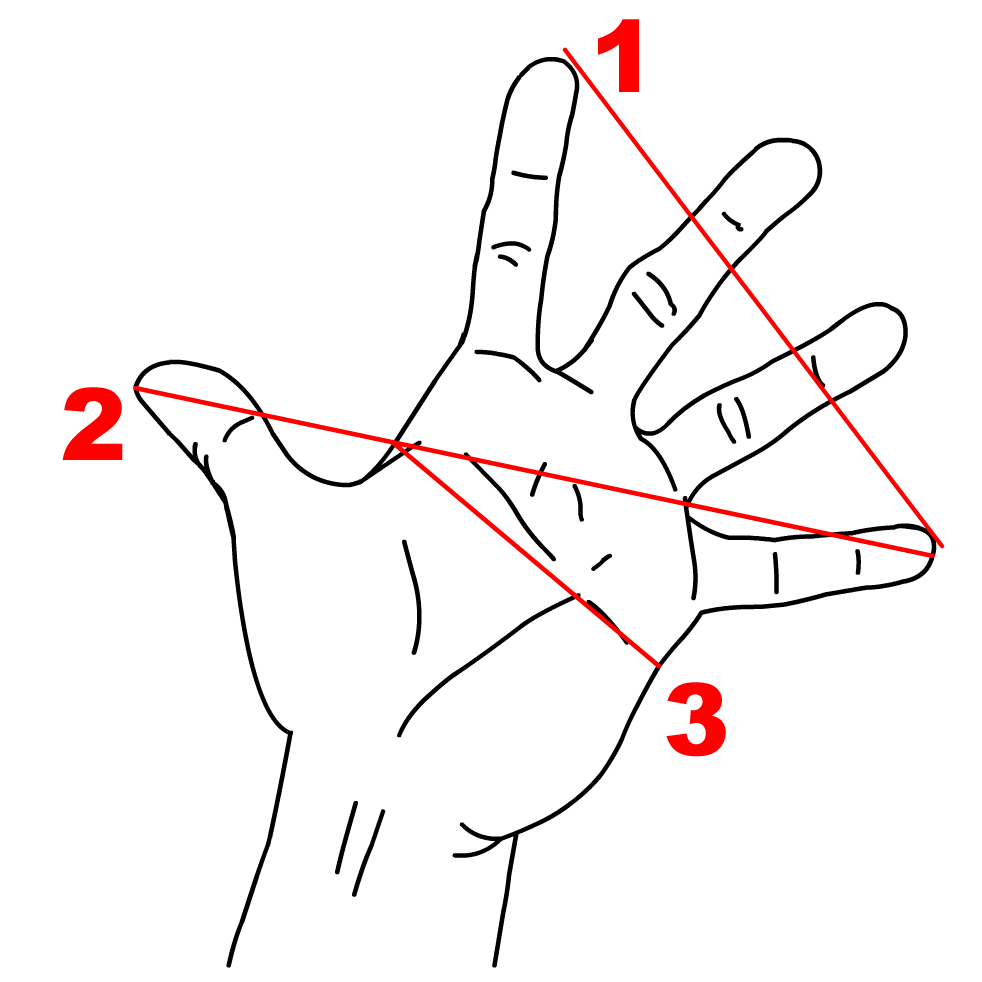

## Contexte et rappels

Dans ce chapitre, nous allons utiliser R pour estimer la relation entre une variable à expliquer et une ou plusieurs autres variables. Nous effectuerons quelques rappels d'économétrie, puis effectuerons les calculs à la main dans un premier temps. Ensuite, nous utiliserons des routines permettant d'estimer des modèles de régression linéaire et nous attacherons à expliquer comment lire et extraire les résultats obtenus.

Pour illustrer notre propos, nous tâcherons de relier la mesure de la taille de l'empan à la taille d'un humain. L'empan correspond à la distance entre l'extrêmité du pouce et celle de l'auriculaire, comme illustré sur la Figure \@ref(fig:illustration-empan).

{width="500px"}

En notant $y_i$ la taille de l'individu $i$, et $x$ son empan, il s'agit de regarder si la taille dépend linéairement de l'empan. On pose alors, pour tous les individus $i = 1, \\ldots, n$:

$$y_i = \beta_0 x_i + \beta_1 + \varepsilon_i,$$
avec $\mathbb{E}(\varepsilon_i) = 0, \quad \forall i \in 1,\ldots, n$, $\mathbb{E}(\varepsilon_i \varepsilon_j) = 0, \forall i \ne j$, et $\mathbb{V}(\varepsilon_i) = \sigma^2_{\varepsilon}, \quad \forall i = 1, \ldots, n.$

En termes matriciels, on peut noter :
$$\boldsymbol y = \boldsymbol X \boldsymbol \beta + \boldsymbol \varepsilon,$$
avec $\boldsymbol \varepsilon \sim \mathcal{N}(0, \Sigma^2)$, et 
\begin{align*}
  \textrm{où } \boldsymbol y = \begin{bmatrix}
		y_1 \\ y_2 \\ \vdots \\ y_n
	\end{bmatrix}, \, \boldsymbol X = \begin{bmatrix}
	  1 & x_{1,1}  \\
	  1 & x_{1,2}  \\
	  1 & \vdots  \\
	  1 & x_{1,n} 
 \end{bmatrix}, \, \boldsymbol \beta =  \begin{bmatrix}
 	\beta_0\\
 	\beta_1\\
 \end{bmatrix} \textrm{ et } \boldsymbol \varepsilon = \begin{bmatrix}
   \varepsilon_1\\
   \varepsilon_2\\
 	\vdots\\
 	\varepsilon_n
 \end{bmatrix}.
\end{align*}

La méthode des moindres carrés ordinaires (MCO) propose une estimation $(\hat\alpha, \hat\beta)$ telle que la somme des carrés des résidus soit minimisée:
$$\arg \min_{\boldsymbol \beta}\mid \mid \boldsymbol y - \boldsymbol X \boldsymbol \beta \mid \mid^2 = \arg \min_{\boldsymbol \beta} \sum_{i=1}^{n} (y_i - x_i \beta)^2.$$

Les résidus correspondent à l'écart entre la valeur observée de la taille $y_i$ et celle prédite par le modèle $\hat y_i$ : $e_i = y_i - \hat y_i$.

Le modèle estimé s'écrit :

$$\hat{y_i} = \hat{\beta_0} + \hat{\beta_1} x_i,$$
soit, en termes matriciels:
$$\hat{\boldsymbol y} = \boldsymbol X \hat{\boldsymbol \beta},$$
\begin{align*}
	\textrm{où } \hat{\boldsymbol y} = \begin{bmatrix}
		\hat{y}_1 \\ \hat{y}_2 \\ \vdots \\ \hat{y}_n
	\end{bmatrix}, \, \boldsymbol X = \begin{bmatrix}
	  1 & x_{1,1} \\
	  1 & x_{1,2} \\
	  1 & \vdots \\
	  1 & x_{1,n}
 \end{bmatrix}, \textrm{ et } \hat{\boldsymbol \beta} =  \begin{bmatrix}
  \hat{\beta}_0\\
 	\hat{\beta}_1\\
 \end{bmatrix}.
\end{align*}

La condition du premier ordre donne^[On utilise les propriétés suivantes : $\frac{\partial \boldsymbol x^t \boldsymbol A}{\partial \boldsymbol x} = \boldsymbol A^t$, $\frac{\partial \boldsymbol A \boldsymbol x}{\partial \boldsymbol x} = \boldsymbol A$ et $\frac{\partial a \boldsymbol \varepsilon}{\partial \boldsymbol x} = a \frac{\partial u}{\partial \boldsymbol x}$, avec $u = u(\boldsymbol x)$.] :
\begin{empheq}{align*}
& \boldsymbol X^t \boldsymbol X\hat{\boldsymbol \beta} - 2 \boldsymbol X^t \boldsymbol X \hat{\boldsymbol \beta} - 2 \boldsymbol X^t \boldsymbol y = 0\notag\\
  \Leftrightarrow \quad & \boldsymbol X^t \boldsymbol X \hat{\boldsymbol\beta} = \boldsymbol X^t \boldsymbol y\notag\\
	\Leftrightarrow \quad & \hat{\boldsymbol\beta} = (\boldsymbol X^t \boldsymbol X)^{-1} \boldsymbol X^t \boldsymbol y.
\end{empheq}

<!-- # Seance 7 -->
<!-- # regressions -->

<!-- # Seance 8 -->
<!-- # Fonctions -->
<!-- # Boucles -->

<!-- # Seance 10 -->
<!-- # Graphiques -->

<!-- # Seance 11 -->
<!-- # Graphiques -->

## Références
