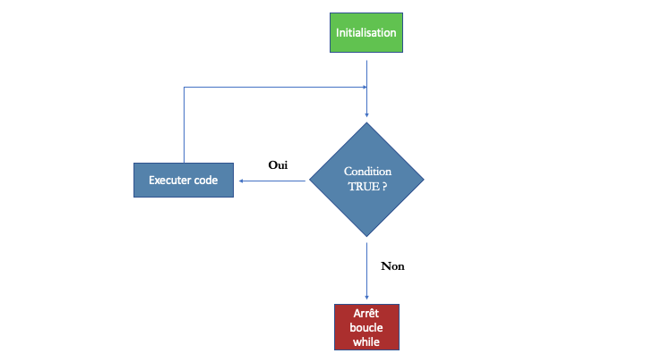
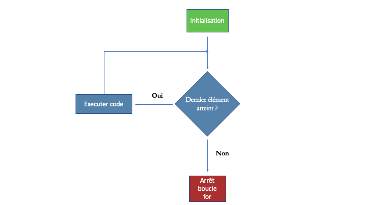

# Instructions conditionnelles et boucles

::::{.orangebox data-latex=""}

Ce chapitre s'appuie sur les notes de cours concernant les [boucles](http://egallic.fr/Enseignement/R/Book/boucles.html).

:::

Lorsqu'une ou plusieurs instructions doivent être répétées jusqu'à ce qu'une condition soit atteinte, plutôt que d'évaluer manuellement chaque itération du processus de répétition, nous pouvons utiliser des boucles. Dans ce chapitre, nous allons dans un premier temps aborder la notion d'instructions conditionnelles, puis nous verrons deux types de boucles.


## Instructions conditionnelles

Dans le [chapitre 2](#types-de-données), nous avons rencontré les données de type logique (`TRUE`{.R}, `FALSE`{.R} et `NA`{.R}). Lorsque nous avons réalisé des indexations d'objets par condition, nous avons fait appel à des valeurs logiques retournées par l'évaluation **d'instructions conditionnelles**. Dans ce chapitre, nous allons également nous appuyer sur des valeurs logiques retournées par l'évaluation d'instructions conditionnelles, pour savoir si un morceau de code doit être évalué ou non. La compréhension du fonctionnement des intructions conditionnelles nous permettra par la suite de pouvoir utiliser des boucles, pour savoir si le processur itératif doit continuer ou s'arrêter.

### Instruction `if`

Avec une instruction `if`, une action sera prise seulement si une condition particulière est vérifiée. La syntaxe est simple :
```{r, eval=FALSE}
if(instruction_conditionnelle) action
```


avec `instruction_conditionnelle` une instruction conditionnelle retournant une valeur logique, et `action` une instruction qui sera évaluée uniquement si le logique retourné par l'instruction conditionnelle vaut `TRUE`{.R}.

Voici un exemple simple. Admettons que nous disposons d'un objet `x` contenant un entier naturel. Par xemple, supposons que `x` contient l'âge d'une personne, et que nous soyons amenés à divulguer une information à cette personne que si celle-ci a 13 ans ou plus. L'information peut être par exemple l'affichage du message suivant : "La fée des dents n'existe pas".

Admettons que la personne nous ait indiqué avoir 22 ans.
```{r}
x <- 22
```

Pour vérifier si la personne a 13 ans ou plus, on peut écrire l'instruction conditionnelle suivante, qui nous retourne `TRUE`{.R} ici :
```{r}
x >= 13
```

Écrivons à présent notre instruction conditionnelle. Si la personne a 13 ans ou plus, nous afficherons un message dans la console, à l'aide de la fonction `print()`{.R} :

```{r}
if(x >= 13) print("La fée des dents n'existe pas")
```


Admettons à présent que la personne à qui nous faisons face n'est âgée que de 5 ans.
```{r}
x <- 5
```

Cette fois-ci, lorsqu'on évalue notre instruction conditionnelle, la valeur logique retournée est `FALSE`{.R} :
```{r}
x >= 13
```

 
 Aussi, l'évaluation de notre instruction `if` ne donnera pas lieu à l'évaluation de l'action :
```{r}
if(x >= 13) print("La fée des dents n'existe pas")
```
 

Si l'action à réaliser est composée de plusieurs instructions, la syntaxe de l'instruction `if` est légèrement modifiée : l'action est simplement placée à l'intérieur d'accolades `{}`{.R}.
```{r, eval=FALSE}
if(instruction_conditionnelle) {
  action_1
  action_2
  ...
  action_n
}
```


Retournons à notre exemple pour illustrer cela. Admettons que nous souhaitons afficher la carré de l'âge de la personne en plus du message.

Retournons à notre individu de 22 ans :
```{r}
x <- 22
```


L'instruction `if` :
```{r}
if(x >= 13) {
  age_carre <- x^2
  print(paste("Votre age au carré vaut :", age_carre))
  print("La fée des dents n'existe pas")
}
```


:::: {.notebox data-latex=""}

**Note**

L'instruction conditionnelle a été évaluée et la valeur logique `TRUE`{.R} a été retournée :
```{r}
x >= 13
```

Comme l'instruction logique vaut `TRUE`{.R}, les instructions à l'intérieur des accoldes ont été exécutées. Dans un premier temps, la variable `age_carre` a été créée. On peut noter que cette variable existe encore après l'évaluation de l'instruction `if` :
```{r}
age_carre
```

Ensuite, les deux instructions suivantes permettant d'afficher des messages dans la console ont été évaluées.

:::


Si notre individu est plus jeune :
```{r}
x <- 5
```


Le test `x >=13`{.R} retourne `FALSE`{.R} et les actions à l'intérieur des accolades ne sont pas réalisées.
```{r}
if(x >= 13) {
  age_carre <- x^2
  print(paste("Votre age au carré vaut :", age_carre))
  print("La fée des dents n'existe pas")
}
```

:::: {.notebox data-latex=""}

**Note**

L'instruction conditionnelle `x >=13`{.R} ayant retourné la valeur logique `FALSE`{.R}, la valeur de la variable `age_carre` calculée précédemment n'a pas été modifiée :
```{r}
age_carre
```


:::


::::{.greenbox data-latex=""}

1. La fonction `readline()`{.R} permet de demander à un utilisateur de rentrer une valeur dans la console. En affectant la valeur lue dans la console dans une variable, l'information donnée par l'utilisateur peut être stockée. Évaluez l'instruction suivante, et écrivez votre âge dans la console, puis validez en appuyant sur la touche `Entrée` :
    ```{r, eval=FALSE}
age <- readline(prompt="Votre âge : ")
    ```

2. Rédigez une instruction conditionnelle qui retourne la racine carrée de l'âge renseigné par l'utilisateur (stockée dans l'objet `age`) uniquement si la valeur stockée dans `age` est comprise entre 20 et 25.
3. Essayez d'évaluer votre instruction en renseignant différentes valeurs pour âge : 18 ans, 22 ans, 27 ans.


:::

### Instruction `if-else`

Dans notre exemple, si l'individu est âgé de 13 ans ou plus, nous lui retournons une information. Dans le cas contraire, aucune action n'est menée. Si nous souhaitons réaliser une action dans les deux cas, que notre individu soit âgé de moins de 13 ans ou qu'il ait 13 ans ou plus, nous pouvons utiliser une instruction `if-else`. La syntaxe est la suivante :
```{r, eval=FALSE}
if(instruction_conditionnelle) {
  # Si instruction_conditionnelle retourne TRUE
  action_1
  action_2
  ...
  action_n
}else {
  # Sinon
  action_a
  action_b
  ...
  action_x
}
```


Pour notre individu, s'il est âgé de 13 ans ou plus, nous lui afficherons son âge au carré et le message d'information. Si en revanche l'individu est trop jeune, nous lui indiquerons un autre message. Admettons que l'utilisateur soit âgé de 22 ans :
```{r}
age <- 22
```

Notre instructions `if-else` sera :

```{r}
if(age >= 13){
  age_carre <- age^2
  print(paste("Votre age au carré vaut :", age_carre))
  print("La fée des dents n'existe pas")
}else{
  print("La fée des dents passera-t-elle cette nuit ?")
}
```

Seules les instructions dans le bloc de code correspondant aux actions à conduire si l'âge est supérieur ou égal à 13 sont évaluées. Si à présent notre individu est âgé de 5 ans :
```{r}
age <- 5
```

L'instruction logique `age >= 13`{.R} retournera `FALSE`{.R}. Les actions à mener si l'instruction logique retourne `TRUE`{.R} ne seront pas évaluées. En revanche, l'instruction à conduire dans le cas où l'instruction logique retourne `FALSE`{.R} sera bien évaluée :
```{r}
if(age >= 13){
  age_carre <- age^2
  print(paste("Votre age au carré vaut :", age_carre))
  print("La fée des dents n'existe pas")
}else{
  print("La fée des dents passera-t-elle cette nuit ?")
}
```


Il est possible d'imbriquer des conditions `if` ou `if-else` à l'intérieure de conditions `if` et `if-else`. Par
```{r}
age <- 22

if(age >= 13){
  
  if(age >= 18){
    print("Vous êtes majeur(e)")
  }
  
  age_carre <- age^2
  print(paste("Votre age au carré vaut :", age_carre))
  print("La fée des dents n'existe pas")
}else{
  
  if(age < 7){
    print("Vous n'avez pas atteint l'âge de raison")
  }else{
    print("Vous avez atteint l'âge de raison")
  }
  
  print("La fée des dents passera-t-elle cette nuit ?")
}
```

Dans le code précédent :

- Si la valeur de l'objet `age` est supérieure ou égale à 13 :

    - Si la valeur de l'objet `age` est supérieure ou égale à 18 : le message "Vous êtes majeur(e)" s'affiche
    - Si la valeur de l'objet `age` est n'est pas supérieure ou égale à 18, le message "Vous êtes majeur(e)" ne s'affiche pas
    - Que la valeur de l'objet `age` soit supérieure ou égal à 18 ou non, du moment qu'elle est supérieure ou égale à 13, le carré de l'âge est calculé et les deux messages indiquant la valeur de l'âge au carré et la terrible vérité au sujet de l'existance de la fée des dents s'affichent.
    
- Si la valeur de l'objet `age` n'est pas supérieure ou égale à 13 :

   - Si de surcroît la valeur de l'objet `age` est inférieure à 7 : le message "Vous n'avez pas atteint l'âge de raison" s'affiche
   - Si en revanche la valeur de l'objet `age` n'est pas inférieure à 7 (mais bien inférieure à 13) : le message "Vous avez atteint l'âge de raison" s'affiche.
   - Que la valeur de l'objet `age` soit inférieure ou non à 7 (du moment qu'elle est inférieure à 13), le message "La fée des dents passera-t-elle cette nuit ?" s'affiche.


::::{.greenbox data-latex=""}

1. Demandez à l'utilisateur de renseigner sa moyenne dans les deux Éléments Constitutifs de l'Unité d'Enseignement d'Economie et Finance internationales :
    ```{r, eval=FALSE}
finance_inter <- 
      readline(prompt="Votre moyenne en Finance internationale : ")
eco_inter <- 
  readline(prompt="Votre moyenne en Economie internationale : ")
    ```
2. Si la moyenne à l'Unité d'Enseignement est supérieure ou égale à 10, affichez dans la console le message suivant : "Vous validez l'UE". Si en revanche la moyenne est inférieure à 10, affichez dans la console le message "Vous ne validez pas l'UE".
3. Reprenez le code de la question précédente, et ajoutez la fonctionnalité suivantes :

    - Si la personne ne valide pas l'Unité d'Enseignement (moyenne aux deux épreuves inférieure à 10), indiquez-lui quelles sont les matières à repasser (uniquement celles pour lesquelles la note est strictement inférieure à 10).


:::


Il est possible de vérifier successivement des instructions conditionnelles et d'effectuer une action dès lors qu'une des instructions est évaluée à `TRUE`{.R}. Pour notre exemple de message à afficher en fonction de l'âge de l'utilisateur, on peut dans un premier temps regarder si l'individu a moins de 13 ans et lui adresser un message adapté ; puis, s'il n'a pas moins de 13 ans, s'il a moins de 18 ans et lui adresser un autre message ; et enfin, s'il n'a pas moins de 18, lui retourner un message encore différent. La syntaxe de ce type d'expression sera la suivante :
```{r, eval=FALSE}
if(instruction_conditionnelle_1){
  actions_1
}else if(instruction_conditionnelle_2){
  actions_2
}else{
  actions_3
}
```


Si notre individu a 7 ans :
```{r}
age <- 7

if(age < 13){
  print(paste("L'âge que vous avez indiqué :", age, "ans"))
  print("L'âge minimum pour s'inscrire est de 13 ans.")
}else if(age < 18){
  print(paste("L'âge que vous avez indiqué :", age, "ans"))
  print("Contenus sensibles masqués.")
}else{
  print(paste("L'âge que vous avez indiqué :", age, "ans"))
  print("Contenus sensibles non masqués.")
}
```

La valeur de l'objet `age` étant `7`{.R}, l'instruction `age < 13`{.R} retourne `TRUE`{.R} et seules les instructions à l'intérieur du premier bloc défini par les accolades sont exécutées.


Si notre individu a 22 ans :
```{r}
age <- 22

if(age <= 13){
  print(paste("L'âge que vous avez indiqué :", age, "ans"))
  print("L'âge minimum pour s'inscrire est de 13 ans.")
}else if(age < 18){
  print(paste("L'âge que vous avez indiqué :", age, "ans"))
  print("Contenus sensibles masqués.")
}else{
  print(paste("L'âge que vous avez indiqué :", age, "ans"))
  print("Contenus sensibles non masqués.")
}
```


La valeur de l'objet `age` étant `7`{.R}, l'instruction `age < 13`{.R} retourne `FALSE`{.R}. Les instructions à l'intérieur du premier bloc défini par les accolades ne sont pas exécutées. La deuxième instruction conditionnelle, `age < 18`{.R}, est évaluée et retourne `FALSE`{.R}. Les instructions à l'intérieur du deuxième bloc défini par les accolades ne sont pas exécutées. Il n'y a pas d'autres instruction conditionnelle avant le mot clé `else`{.R}, donc le code à l'intérieur du bloc défini par les accolades associées à `else`{.R} est évalué.


## Boucles


Il existe deux sortes de boucles dans R. Celles pour lesquelles les itérations continuent tant qu'une condition n'est pas invalidée (`while()`{.R}), et celles pour lesquelles le nombre d’itérations est défini au moment de lancer la boucle (`for()`{.R}).

### Boucles `while()`


Les codes à l'intérieur d'une boucle `while` seront évaluées de manière itérative. Avant chaque itération, une instruction conditionnelle est évaluée. Si cette instruction retourne le logique `TRUE`{.R}, le code est évalué. Puis débute une nouvelle itération. Si en revanche l'instruction conditionnelle retourne le logique `FALSE`{.R}, le code n'est pas évalué et le processus itératif cesse. Le schéma de la Figure \@ref(fig:boucle-while) illustre le fonctionnement d'une boucle `while()`{.R}.

{width="75%"}

La syntaxte est la suivante :
```{r, eval=FALSE}
while(condition) instruction
```

Ou encore, si plusieurs instructions doivent être évaluées à chaque itération :
```{r, eval=FALSE}
while(condition){
  instruction_1
  instruction_2
  ...
  instruction_n
}
```


Prenons un exemple. Soit un entier `x` contenant une valeur qui peut varier. Admettons que cette valeur vaille 50 :
```{r}
x <- 50
```

Créons une boucle `while` dans laquelle chaque itération vient diviser la valeur de `x` par 3, puis remplace l'ancienne de valeur de `x` par le résultat de la division :
```{r}
while(x / 3 > 1){
  print(x / 3)
  x <- x/3
}
```


::::{.notebox data-latex=""}

Regardons pas-à-pas les étapes du processus itératif précédent.
Lors de l'initialisation, la valeur de `x` vaut 50.


L'instruction conditionnelle `x / 3 > 1`{.R} est évaluée et retourne le logique `TRUE`{.R}. En effet, 50/3 ~ 16.66667 est bien strictement supérieur à 1.

- La _première itération_ commence.
- Le bloc de code de la boucle, défini par les accolades, peut alors être évalué.
- La valeur `x/3` est affichée avec la fonction `print()`{.R} : la valeur `16.66667`{.R} s'affiche dans la console.
- Puis, la valeur de `x` est remplacée par le tiers de sa valeur (`x <- x/3`{.R}).
- La nouvelle valeur de `x` est donc `16.66667`{.R}.
- La première itération s'achève.

Ensuite, l'instruction conditionnelle `x / 3 > 1`{.R} est évaluée et retourne le logique `TRUE`{.R}. En effet, 16.66667/3 ~ 5.555556 est bien strictement supérieur à 1.

- La _deuxième itération_ commence.
- Le bloc de code de la boucle, défini par les accolades, peut alors être évalué.
- La valeur `x/3` est affichée avec la fonction `print()`{.R} : la valeur `5.555556`{.R} s'affiche dans la console.
- Puis, la valeur de `x` est remplacée par le tiers de sa valeur (`x <- x/3`{.R}).
- La nouvelle valeur de `x` est donc `5.555556`{.R}.
- La deuxième itération s'achève.

L'instruction conditionnelle `x / 3 > 1`{.R} est évaluée et retourne le logique `TRUE`{.R}. En effet, 5.555556/3 ~ 1.851852 est bien strictement supérieur à 1.

- La _troisième itération_ commence.
- Le bloc de code de la boucle, défini par les accolades, peut alors être évalué.
- La valeur `x/3` est affichée avec la fonction `print()`{.R} : la valeur `1.851852`{.R} s'affiche dans la console.
- Puis, la valeur de `x` est remplacée par le tiers de sa valeur (`x <- x/3`{.R}).
- La nouvelle valeur de `x` est donc `1.851852`{.R}.
- La troisième itération s'achève.

L'instruction conditionnelle `x / 3 > 1`{.R} est évaluée et retourne le logique `FALSE`{.R}. En effet, 1.851852/3 ~ 0.617284 et n'est donc pas strictement supérieur à 1. Le processus itératif s'arrête. La valeur contenue dans `x` est donc `1.851852`{.R}.


:::


::::{.notebox data-latex=""}

Il n'existe pas qu'une seule manière de rédiger des boucles. Il est parfois utile, avec une boucle `while`, de créer une variable (que l'on peut appeler `continuer` par exemple) contenant une valeur logique `TRUE`{.R} et d'utiliser cette variable comme instruction conditionnelle pour continuer les itérations. Le code à l'intérieur de la boucle se chargera de venir changer la valeur de cette variable au moment opportun. Par exemple, pour obtenir le même résultat dans `x` que dans l'exemple précédent, on pourra écrire :

```{r}
x <- 50
continuer <- (x / 3 > 1)

while(continuer){
  print(x / 3)
  
  if(x / 3 < 1){
    continuer <- FALSE
  }else{
    x <- x/3
  }
}

x

```

Pour éviter de créer la variable `continuer`, nous pouvons utiliser le mot clé `break`{.R} à l'intérieur de la boucle pour stopper la boucle au moment opportun.

```{r}
x <- 50
while(TRUE){
  print(x / 3)
  
  if(x / 3 < 1){
    break
  }else{
    x <- x/3
  }
}
x
```


:::


::::{.greenbox data-latex=""}

**Exercice**

À l’aide de la fonction `while()`, créez une boucle qui permet de calculer la factorielle d’un nombre.


:::


::::{.greenbox data-latex=""}

**Exercice bonus**


À l'aide d'une boucle `while`, créez un code dans lequel vous devrez tenter de faire deviner un nombre magique tiré aléatoirement entre 1 et 100.

Dans une première étape, un nombre magique est tiré aléatoirement :
```{r}
nombre_magique <- sample(x=1:100, size = 1)
```

Votre code doit demander à l'utilisateur d'entrer une réponse :
```{r, eval=FALSE}
tentative <- 
  readline(prompt="Nombre entier compris entre 1 et 100 : ")
```

Vous devez ensuite indiquer, à l'aide d'instructions conditionnelles si le nombre donné par l'utilisateur est inférieur, supérieur, ou égal au nombre magique.


```{r, echo=FALSE, eval=FALSE}
nombre_magique <- sample(x=1:100, size = 1)
continuer <- TRUE

while(continuer){
  tentative <- readline(prompt="Nombre entier compris entre 1 et 100 : ")
  if(tentative < nombre_magique){
    print(str_c("Le nombre magique est plus grand que ", tentative))
  }else if(tentative > nombre_magique){
    print(str_c("Le nombre magique est plus petit que ", tentative))
  }else{
    print(str_c("Bravo, le nombre magique est ", tentative))
    continuer <- FALSE
  }
}

```


:::


### Boucles `for()`


Lorsqu'on connaît _a priori_ le nombre d'itérations que l'on souhaite faire, il est coutume de faire appel à une boucle `for()`{.R}. On définit un itérateur qui prendra successivement des valeurs dans un ensemble donné jusqu'à ce que toutes les valeurs de l'ensemble auront été utilisées comme itérateur. La syntaxe est la suivante :
```{r, eval=FALSE}
for(iterateur in ensemble){
  instruction_1
  instruction_2
  ...
  instruction_n
}
```

Le schéma de la Figure \@ref(fig:boucle-for) illustre le fonctionnement d'une boucle `for()`{.R}.


{width="75%"}


Illustrons par ailleurs le fonctionnement à l'aide d'un exemple simple. Considérons un itérateur que l'on nommera `i` et l'ensemble des entiers naturels de 1 à 10. À chaque itération, `i` prendra une des valeurs de l'ensemble :

```{r}
for(i in 1:10){
  carre <- i^2
  print(paste("Le carré de", i, "est :", carre))
}
```

::::{.notebox data-latex=""}

Regardons en détail ce qu'il s'est passé lors de l'éxécution de ce bout de code.

- À la _première itération_, l'objet `i` est créé et la valeur `1`{.R} lui est affectée (si un objet `i` existait déjà, sa valeur eut été remplacée par la valeur `1`).
- L'objet `carre` est créé et le carré de `i`, c'est à dire $1^2=1$ lui est affecté.
- La chaîne de caractère indiquant la valeur de `i` et de son carré est ensuite affichée dans la console.
- La première itération prend fin.
- L'ensemble des valeurs des entiers de 1 à 10 n'a pas encore été utilisé lors du processus itératif ; ce dernier se poursuit donc.
- La _deuxième itération_ débute, et la valeur de l'objet `i` devient la valeur suivante de l'ensemble `1:10`{.R}, c'est-à-dire 2.
- La valeur du carré de `i`, c'est-à-dire $2^2=4$ est affectée à l'objet `carré`.
- La chaîne de caractère indiquant la valeur de `i` et de son carré est ensuite affichée dans la console.
- La deuxième itération prend fin.
- L'ensemble des valeurs des entiers de 1 à 10 n'a pas encore été utilisé lors du processus itératif ; ce dernier se poursuit donc.
- ...
- La _dixième itération_ débute, et la valeur de l'objet `i` devient la valeur suivante de l'ensemble `1:10`{.R}, c'est-à-dire 10.
- La valeur du carré de `i`, c'est-à-dire $10^2=100$ est affectée à l'objet `carré`.
- La chaîne de caractère indiquant la valeur de `i` et de son carré est ensuite affichée dans la console.
- La dixième itération prend fin.
- L'ensemble des valeurs des entiers de 1 à 10 a été utilisé lors du processus itératif ; ce dernier s'achève.


:::


::::{.notebox data-latex=""}

**Note**

À l'issue des itérations, l'objet `i` contient la dernière valeur de l'ensemble.


:::


::::{.notebox data-latex=""}

**Note**

Nous pouvons utiliser une boucle `while()`{.R} pour obtenir le même résultat. Le code est un tout petit moins lisible. 

```{r}
i <- 0
while(i < 10){
  i <- i+1
  carre <- i^2
  print(paste("Le carré de", i, "est :", carre))
}
```

:::


L'ensemble de valeurs n'est pas nécessairement composé d'entiers. Il peut s'agir de n'importe quel élément contenu dans une structure sur laquelle il est possible d'itérer :

```{r}
for(i in c("A", "B", "C")){
  print(paste("La valeur courante de i vaut :", i))
}

for(i in list(toto=c(1,2), titi=c("A", "B"))){
  print(i)
}
```


::::{.greenbox data-latex=""}

**Exercice**

Si vous avez quelques interrogations quant à l'utilité des boucles dans le cadre de vos études en économie, cet exercice devrait vous permettre d'apprécier le gain de temps potentiel que celles-ci peuvent vous faire gagner.

Il s'agit d'importer une multitude de fichiers CSV (en l'occurence, 35) présentant une structure similaire. Ces fichiers contiennent des observations de commptage de vélos à des points spécifiques de la ville de Paris, en 2018. Chaque fichier correspond à une localisation donnée, la localisation est utilisée comme nom de fichier.


Les 35 fichiers CSV sont contenus dans une archive Zip disponible à l'adresse suivante : <https://egallic.fr/Enseignement/R/Exercices/Boucles/velo.zip>. (_Note_ : Les données brutes sont disponible sur le [site de l'open data de la ville de Paris](https://opendata.paris.fr/explore/dataset/comptage-velo-historique-donnees-compteurs/information/).)


1. Téléchargez l'archive contenant les 35 fichiers CSV, puis extrayez son contenu dans le dossier `Data` de votre répertoire de projet.
2. Créez un objet que vous nommerez `df_velo` qui contiendra la valeur `NULL`{.R}.
3. Importez le fichier `Voie_Georges_Pompidou.csv` dans R, dans un objet que vous nommerez `df_tmp`.
4. Utilisez la fonction `bind_rows()`{.R} pour empiler les données du tableau `df_tmp` sur `df_velo`. Le résultat doit venir écraser l'objet `df_velo` pour que son contenu devienne le résultat de l'application de la fonction `bind_rows()`{.R}. Le tableau `df_velo` contiendra alors 17 473 observations.
5. Importez le fichier `106_Avenue_Denfert_Rochereau_NE-SO.csv` dans R, dans un objet que vous nommerez `df_tmp`.
6. Utilisez la fonction `bind_rows()`{.R} pour empiler les données du tableau `df_tmp` sur `df_velo`. Le résultat doit venir écraser l'objet `df_velo` pour que son contenu devienne le résultat de l'application de la fonction `bind_rows()`{.R}. Votre tableau `df_velo` contiendra alors les 17 473 observations du premier fichier et les 8 737 du deuxième, soit 26 210 observations.
7. Importez le fichier `28_Boulevard_Diderot.csv` dans R, dans un objet que vous nommerez `df_tmp`.
8. Utilisez la fonction `bind_rows()`{.R} pour empiler les données du tableau `df_tmp` sur `df_velo`. Le résultat doit venir écraser l'objet `df_velo` pour que son contenu devienne le résultat de l'application de la fonction `bind_rows()`{.R}. Votre tableau `df_velo` contiendra alors les 17 473 observations du premier fichier, les 8 737 du deuxième, et les 17 473 du troisième, soit 43 684 observations.
9. Prenez le temps d'imginer à quel point il serait pénible d'empiler les 35 fichiers.

À présent, tentons de réfléchir à l'utilisation d'une boucle pour effectuer la tâche. Les premières questions devraient vous laisser apercevoir que vous avez réalisé une tâche répétitive qui consiste à chaque itération à charger un fichier et à ajouter son contenu à un tableau existant. Vous avez donc besoin dans un premier temps de récupérer dans un vecteur le lien de chacun des fichiers. Pour ce faire, vous allez utiliser la fonction `list.files()`{.R}, qui permet de lister le contenu d'un répertoire.
```{r}
N <- list.files("Data/velo/", full.names = TRUE)
N
```

L'objet `N` consistera votre ensemble sur lequel itérer.

10. À l'aide d'une boucle `for()`{.R}, chargez l'ensemble des 35 fichiers CSV du répertoire `velo` et placez leur contenu dans un tableau de données que vous nommerez `df_velo`.


:::


::::{.greenbox data-latex=""}

**Exercice bonus**

Utilisez une boucle `for()`{.R} pour reproduire la suite de Fibonacci jusqu’à son dixième terme (la séquence $F_n$ est définie par la relation de récurrence suivante : $F_n=F_n−1+F_n−2$ ; les valeurs initiales sont : $F_0=0$ et $F_1=1$).


:::

<!-- # Seance 8 -->
<!-- # Fonctions -->
<!-- # Boucles -->


<!-- # Seance 10 -->
<!-- # Graphiques -->

<!-- # Seance 11 -->
<!-- # Graphiques -->

```{r, echo=FALSE, eval=F}
rmarkdown::render("09_Boucles.Rmd")
```


Des compléments sur les fonctions de type `lapply()`{.R} ou `map()`{.R} vous permettront de réaliser des opérations répétées. Nous n'aurons malheureusement pas le temps de les aborder dans le cadre de ces travaux dirigés. En revanche, vous êtes invité(e) à consulter la [section consacrée à la vectorisation](http://egallic.fr/Enseignement/R/Book/boucles.html) sur les notes de cours.

# References
